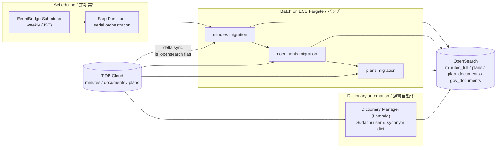
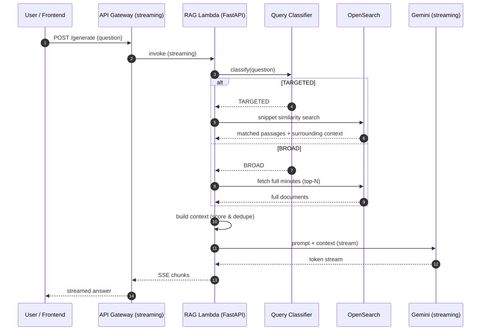

# Architecture / アーキテクチャ

All identifiers below are **placeholders**. This document describes the system shape and the reasoning behind each design decision.
以下の識別子はすべて**プレースホルダ**です。本書ではシステムの構成と各設計判断の「なぜ」を説明します。

---

## 1. System overview / システム全体図

```mermaid
flowchart TB
    subgraph Client["Client / クライアント"]
        UI["Next.js Frontend<br/>(Vercel, NextAuth OAuth)"]
    end

    subgraph Edge["API layer / API層"]
        APIGW["API Gateway<br/>REST + response streaming"]
    end

    subgraph Compute["Serverless compute / サーバーレス"]
        RAG["RAG Chat API<br/>FastAPI on Lambda (arm64)"]
        SEARCH["Search API<br/>FastAPI on Lambda"]
        DR["Deep Research API<br/>Node.js / Mastra on Lambda"]
    end

    subgraph Data["Data & AI / データ・AI"]
        OS[("OpenSearch<br/>4 indices, Sudachi")]
        TIDB[("TiDB Cloud<br/>MySQL-compatible")]
        GEMINI["Google Gemini API"]
        EXA["Exa Web Search"]
    end

    UI --> APIGW
    APIGW --> RAG
    APIGW --> SEARCH
    APIGW --> DR

    RAG --> OS
    RAG --> GEMINI
    SEARCH --> OS
    DR --> OS
    DR --> GEMINI
    DR --> EXA
    RAG -.reads metadata.-> TIDB
```

**Why this shape / なぜこの構成か**
- **Serverless-first (Lambda + API Gateway):** バースト的でスパイクの大きい検索/対話ワークロードに対し、常時起動サーバを持たずスケールとコストを両立。
- **Lambda Web Adapter:** 既存のFastAPI/ASGIアプリを書き換えずにLambdaで実行し、コールドスタートを抑制。
- **Response streaming:** RAG応答をSSEでストリーミングし、サーバーレスでもチャットのリアルタイム性を確保。
- **arm64 (Graviton):** 同性能で低コスト。I/O待ちの多いAPI用途に適合。
- **Service separation:** 検索 / RAG / Deep Research を独立Lambdaに分離し、スケール特性とデプロイ独立性を確保。

---

## 2. Data pipeline / データパイプライン

**Why this shape / なぜこの構成か**
- **Incremental (delta) sync:** `is_opensearch` フラグで未同期レコードだけを対象にし、フル再投入を避けて時間とコストを削減。
- **Parallel bulk ingestion:** パーティション単位でワーカーを並列化し、大量データの投入時間を短縮（N+1回避・サーバサイドカーソルでメモリ効率化）。
- **Step Functions serial run:** 3つのFargateタスク（minutes→documents→plans）を直列実行し、依存関係と失敗時の可視化を担保。
- **EventBridge weekly cron:** ソース更新頻度に合わせた定期同期で運用を無人化。
- **Reusable sync library:** データ変換（NestedDocumentMapper等）を共通ライブラリ化し、新インデックス追加の実装コストを削減。
- **Dictionary automation:** 辞書をTiDBから自動生成→OpenSearchパッケージ更新→Reindexまで自動化し、日本語検索品質を維持。

---

## 3. RAG request flow / RAGリクエストフロー

**Why this shape / なぜこの構成か**
- **BROAD vs. TARGETED classification:** 質問の性質で検索戦略を動的に切替。ピンポイントな問いはスニペット類似度＋前後文脈、俯瞰的な問いは全文（上位N件）を投入し、精度とコンテキスト量のバランスを取る。
- **Context scoring & dedupe:** プロンプト生成前に冗長度・類似度をスコアリングし、限られたトークン枠を有効活用。
- **End-to-end streaming:** OpenSearch→Gemini→API Gateway→クライアントまでストリーミングを貫通させ、初トークンまでの体感待ち時間を短縮。

---

## Cross-cutting concerns / 横断的関心事

- **Type safety / 型安全:** 構造化データはすべて Pydantic `BaseModel`。`Any` を排し、境界でバリデーション。
- **Observability / 可観測性:** Logfire（Pydantic製・OpenTelemetry対応）で全Lambda/バッチを集約ログ化。API Gateway×Lambda を X-Ray で分散トレース。
- **Security / セキュリティ:** OpenSearch は VPC＋セキュリティグループ＋IAMロールで制限。SQLは全てプレースホルダバインディング。最小権限のIAM設計。
- **CI/CD:** GitHub Actions が OIDC でAWSにAssumeRole → ECRへpush → Lambda更新 → スモークテスト → PRへ通知、まで自動化。
