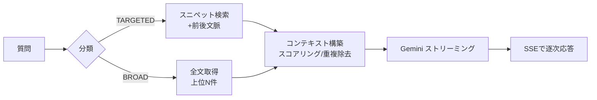

# 02. Streaming RAG Chat / RAGチャット

> Conversational answers grounded in search results, with a dynamic BROAD/TARGETED retrieval strategy and end-to-end streaming on serverless.
> 検索結果を根拠に対話的に回答。BROAD/TARGETEDの動的検索戦略と、サーバーレス上のエンドツーエンド・ストリーミングが特徴。

関連スニペット: [rag_query_router.py](../snippets/rag_query_router.py) / [fastapi_lambda_handler.py](../snippets/fastapi_lambda_handler.py)

---

## 課題 / Problem

「議事録について質問したい」というニーズに対し、単純なキーワード検索では回答にたどり着けない。一方でLLMに全文を丸投げするとトークン超過・コスト増・精度低下を招く。**適切な量の適切な根拠**をLLMに渡す設計が要る。

## 技術的な工夫 / Key engineering decisions

- **入力分類による動的検索戦略（BROAD / TARGETED）**
  質問の性質を分類し、検索方法を切り替える（[rag_query_router.py](../snippets/rag_query_router.py) 参照）。
  - **TARGETED**（ピンポイント: 「予算はいくらか」等）→ スニペット類似度で絞り込み、ヒット箇所＋前後文脈だけを投入
  - **BROAD**（俯瞰: 「議論の全体像は」等）→ 全文（上位N件）を投入
  これにより、限られたコンテキスト枠を質問に応じて最適配分する。

- **コンテキスト構築の最適化（スコアリング＋重複除去）**
  プロンプト生成前に、断片を関連度でスコアリングし文書IDで重複除去。冗長な文脈を落として、トークン枠を有効なコンテキストに使い切る。

- **エンドツーエンド・ストリーミング**
  OpenSearch → Gemini → API Gateway（レスポンスストリーミング）→ クライアント（SSE）まで、応答をトークン単位で流し切る（[fastapi_lambda_handler.py](../snippets/fastapi_lambda_handler.py) 参照）。初トークンまでの体感待ち時間を短縮。

- **サーバーレスでの実行**
  FastAPIアプリを **Lambda Web Adapter** でそのまま実行し、書き換えなしでLambda化＆コールドスタートを抑制。arm64でコスト最適化。

## リクエストフロー / Request flow

## 効果 / Impact

- 質問タイプに応じた検索でコンテキスト品質を維持しつつトークン消費を抑制
- ストリーミングで対話のリアルタイム性を確保（サーバーレスでも体感が速い）
- FastAPIコードを流用しつつサーバーレスの運用コストメリットを享受
