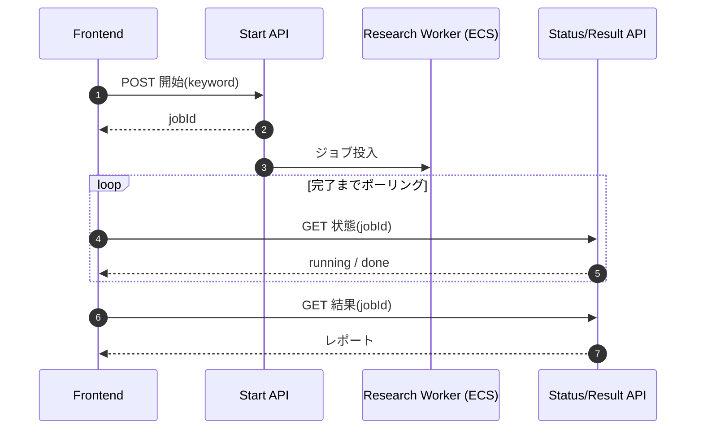

# 03. Multi-Agent Deep Research / Deep Research

> An agent that autonomously expands a keyword into related investigations and produces a cited report, run as an asynchronous long-running job.
> キーワードから関連調査を自動で掘り下げてレポート化するエージェント。長時間処理を非同期ジョブとして実行する。

---

## 課題 / Problem

「単純検索では見つからない関係性や動向」を知りたいというニーズがある。これは1回の検索では完結せず、検索→要約→次の検索…という**多段の探索**を要する。さらに1リクエストが数十秒〜数分に及ぶため、通常の同期APIでは扱えない（タイムアウト・UXの悪化）。

## 技術的な工夫 / Key engineering decisions

- **マルチエージェント・ワークフロー（Mastra）**
  検索と分析を組み合わせたワークフローをMastraで構成。社内ソース（OpenSearch）と外部Web検索（Exa）を横断し、Gemini でレポートを生成。単一プロンプトではなく、探索を段階に分けて品質を高める。

- **非同期ジョブ設計（開始／状態確認／結果取得）**
  長時間処理を、ジョブを**開始**するエンドポイント、**状態確認**（ポーリング）エンドポイント、**結果取得**エンドポイントに分離。フロントは開始後にジョブIDを受け取り、状態をポーリングして完了後に結果を取得する。これによりAPIタイムアウトを回避し、進捗の可視化も可能に。

- **実行基盤の分離**
  短時間のAPI層はLambda、長時間走るリサーチ本体はコンテナワーカー（ECS）に分離。ワークロード特性に応じてコンピュートを使い分ける。

- **型・バリデーション**
  ワークフローの入出力は Zod（Node.js側）でスキーマ定義し、境界で検証。

## 非同期ジョブフロー / Async job flow

## 効果 / Impact

- 単純検索では届かない、関連情報を横断した深掘りレポートを自動生成
- 非同期ジョブ化により長時間処理でもタイムアウトせず、進捗を可視化
- API層とワーカー層の分離で、コストとスケール特性を最適化
