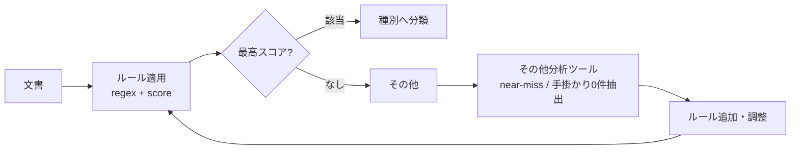
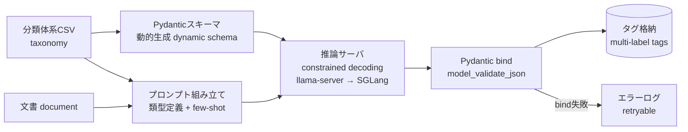

# 04. Rule-Based Document Classification / ドキュメント自動分類

> Transparent, tunable classification of public documents via regex rules + scoring, with a dedicated tooling loop for measuring and improving rules.
> 正規表現ルール＋スコアリングによる透明性の高い文書分類。ルール改善を回すための効果測定ツールを併設。

---

## 課題 / Problem

行政文書は種別（議事録・計画・予算・その他…）がメタデータとして整っていないことが多い。分類は必要だが、いきなり機械学習に頼るとブラックボックス化し、なぜその分類になったかを説明・調整できない。まずは**説明可能で調整可能**な分類が求められる。

## 技術的な工夫 / Key engineering decisions

- **ルールベース＋スコアリング**
  分類ルールをYAMLで管理し、正規表現パターンのマッチをスコア加算で評価。最終的に最高スコアの種別へ分類する。ルールが設定として外出しされているため、非エンジニアでも調整可能で、判断根拠を追える。

- **本文分類は慎重に（オプトイン方式）**
  タイトルは分類の手掛かりとして強いが、本文はノイズも多い。本文をスコアに含めるかどうかを重み（`content_weight`）でオプトイン制御し、誤分類を抑える。

- **「その他」分析ツールでチューニングを回す**
  「その他」に落ちた文書を分析する専用ツールを用意。あと一歩でマッチしなかった**ニアミス**や、手掛かりが**0件**だった文書を自動抽出し、どのルールを足せば拾えるかを可視化。ルール改善→効果測定のループを高速に回す。

## 改善ループ / Tuning loop

## 効果 / Impact

- 分類根拠が追える透明性の高い仕組みで、運用者がルールを直接改善できる
- ニアミス抽出により「次に足すべきルール」がデータドリブンに分かる
- 本文分類のオプトイン制御で、誤分類のリスクをコントロール

---

## 発展: ローカルLLMによる分類実験 / Evolution: Local-LLM classification experiment

> A quick-start experiment: replacing regex rules with a local LLM (constrained decoding) for multi-label classification, benchmarked on real hardware.
> ルールベースの次の一手として、ローカルLLM＋制約デコードによるマルチラベル分類をクイックスタート実験として実機検証。

### 背景 / Motivation

ルールベース分類（本ページ前半）は透明で調整可能な一方、**類型を増やすたびにルール保守が必要**で、タイトルに手掛かりがない文書や文脈依存の判断には届かない。そこで、分類体系を約20類型（マルチラベル: 1文書が複数類型に該当しうる）へ拡張するにあたり、**ローカルLLMで分類できるか・実用速度が出るかを短期集中の実験**として検証した。機密性の高い行政データを外部APIに出さない前提で、推論はすべてオンプレ（NVIDIA DGX Spark / GB10）で実行している。

### 技術的な工夫 / Key engineering decisions

- **分類体系CSVからスキーマを動的生成**
  類型定義CSV（大分類・中分類・定義・判定の手掛かり）を単一のソースとし、Pydantic `create_model` と `Enum` で `ClassificationResult{categories: [{category, confidence}], min_length=1}` を実行時生成。類型の追加・変更はCSVの差し替えだけでプロンプトとスキーマの両方に反映される。

- **制約デコードでスキーマ準拠を強制（準拠率 0% → 100%）**
  llama-server（OpenAI互換API）の `response_format=json_schema` でGBNF制約デコードを有効化。プロンプト指示だけの場合はMarkdownフェンス混入や日本語キーで**Pydanticバインド成功率0%**だったが、制約デコードで**100%**に。応答は必ず `model_validate_json()` でモデルにバインドし、生JSONを辞書のまま扱わない。

- **プレフィックスキャッシュを効かせるプロンプト設計**
  類型定義ブロック（定義＋手掛かりキーワード、約3,300トークン）をsystemプロンプトに固定配置し、サーバ側のプレフィックスキャッシュを最大化。文書本文は文字数上限で切り詰めて可変部を最小化する。

- **few-shotで誤分類パターンを抑制**
  人手評価で見つかった誤分類（過剰付与など）をパターン別に代表例として抽出し、「安易に付けない」区別ルールとしてプロンプト化。few-shot有無で精度を比較評価。

- **性能はモデル選定と実測で裏付け**
  本タスクは長いプロンプト×短い出力の**プリフィル律速**であると特定し、`docs/s ≒ prefill速度 ÷ プロンプトtoken数` のモデル式が実測と一致することを確認。MoEモデル（Qwen3-30B-A3B, Q4_K_M）はdense 32B比で大幅に高速で、並列度スイープによりGB10のプリフィル飽和点まで測定した。

- **評価パイプライン**
  人手評価データを正解として micro/macro の Precision・Recall・F1 と完全一致率、バインド失敗数を自動算出し、プロンプト・モデル変更の効果を定量比較できるようにした。

- **本番の大量処理パイプラインはSGLangを採用**
  実験はllama-serverで開始したが、本ワークロードは「同一のsystemプロンプト × 類似形式の文書」を大量に流すため、**RadixAttentionによるKVキャッシュ（プレフィックスキャッシュ）の自動再利用**の効果が支配的と判断し、最終的に推論バックエンドとして**SGLang**を採用。クライアントをOpenAI互換APIで統一していたため、切り替えは接続先の変更だけで済んだ。

### 分類フロー / Classification flow

### 効果と使い分け / Impact & division of labor

- 制約デコードによりスキーマ準拠率100%を実機で確認し、「JSONで返して」と指示するだけの運用を排除
- 政令指定都市を含む3自治体・全量約16,000件規模の文書を、外部APIに出さずローカル推論のみで分類できる目処を実測ベースで確立
- 実験ハーネスはその後、複数推論エンドポイントへのファンアウトとDB連携（パラメータバインド・冪等な書き込み・チャンク単位コミット）を備えた本番パイプライン（推論バックエンドは**SGLang**）へ発展
- **使い分け**: 判断根拠の説明とルールの直接調整が必要な場面はルールベース、類型数が多く文脈理解が必要なマルチラベル分類はローカルLLM、と役割を分担する
