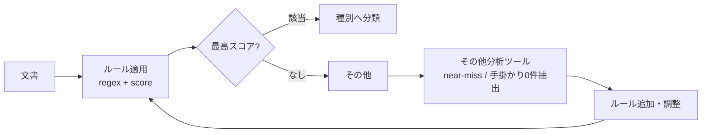

# 04. Rule-Based Document Classification / ドキュメント自動分類

> Transparent, tunable classification of public documents via regex rules + scoring, with a dedicated tooling loop for measuring and improving rules.
> 正規表現ルール＋スコアリングによる透明性の高い文書分類。ルール改善を回すための効果測定ツールを併設。

---

## 課題 / Problem

行政文書は種別（議事録・計画・予算・その他…）がメタデータとして整っていないことが多い。分類は必要だが、いきなり機械学習に頼るとブラックボックス化し、なぜその分類になったかを説明・調整できない。まずは**説明可能で調整可能**な分類が求められる。

## 技術的な工夫 / Key engineering decisions

- **ルールベース＋スコアリング**
  分類ルールをYAMLで管理し、正規表現パターンのマッチをスコア加算で評価。最終的に最高スコアの種別へ分類する。ルールが設定として外出しされているため、非エンジニアでも調整可能で、判断根拠を追える。

- **本文分類は慎重に（オプトイン方式）**
  タイトルは分類の手掛かりとして強いが、本文はノイズも多い。本文をスコアに含めるかどうかを重み（`content_weight`）でオプトイン制御し、誤分類を抑える。

- **「その他」分析ツールでチューニングを回す**
  「その他」に落ちた文書を分析する専用ツールを用意。あと一歩でマッチしなかった**ニアミス**や、手掛かりが**0件**だった文書を自動抽出し、どのルールを足せば拾えるかを可視化。ルール改善→効果測定のループを高速に回す。

## 改善ループ / Tuning loop

## 効果 / Impact

- 分類根拠が追える透明性の高い仕組みで、運用者がルールを直接改善できる
- ニアミス抽出により「次に足すべきルール」がデータドリブンに分かる
- 本文分類のオプトイン制御で、誤分類のリスクをコントロール
