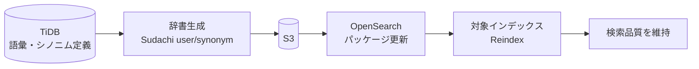

# 05. Dictionary Automation / 辞書自動管理

> Automated lifecycle for Sudachi user & synonym dictionaries — generated from the source DB, pushed to OpenSearch, and re-indexed on a schedule.
> Sudachiのユーザー辞書・シノニム辞書を、ソースDBから自動生成→OpenSearchへ反映→Reindexまで自動化。

関連: [01. 日本語全文検索](01-japanese-fulltext-search.md)

---

## 課題 / Problem

日本語検索の品質は辞書に大きく依存する。制度用語・新しい固有名詞・言い換え（シノニム）を辞書に反映しないと検索の取りこぼしが増える。しかし辞書更新を手作業でやると、生成・反映・Reindexの各ステップが漏れやすく、品質が徐々に劣化する。

## 技術的な工夫 / Key engineering decisions

- **辞書の「生成→反映→Reindex」を全自動化**
  ソースDB（TiDB）で管理する語彙・シノニム定義から、Sudachi用のユーザー辞書とシノニム辞書を自動生成。生成物をOpenSearchのパッケージとして更新し、対象インデックスのReindexまで一連で実行する。人手を介さず辞書ライフサイクルを完結させる。

- **コンテナ化したLambdaで実行**
  Sudachi等の依存を含むためDockerイメージのLambdaとして実装。生成した辞書ファイルはS3を経由してOpenSearchへ登録する。

- **検索基盤との疎結合**
  辞書管理は独立コンポーネントとして分離。検索API側は辞書の中身を意識せず、更新は辞書マネージャに閉じる。

## ライフサイクル / Lifecycle

## 効果 / Impact

- 辞書更新の抜け漏れをなくし、日本語検索の品質を継続的に維持
- 手作業の運用負荷を削減し、語彙の追加をデータ登録だけで反映可能に
- 辞書管理を疎結合化し、検索基盤への影響を局所化
