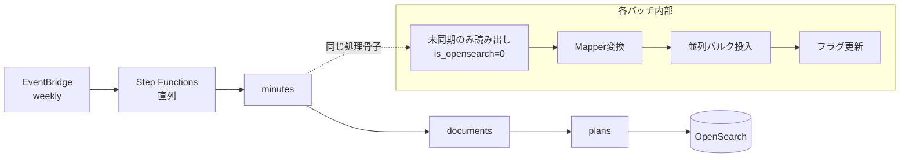

# 06. Data Sync Pipeline / データ同期パイプライン

> A reusable TiDB → OpenSearch sync library with incremental (delta) sync, parallel bulk ingestion, and memory-safe reads — orchestrated serially on a schedule.
> TiDB→OpenSearchを差分同期・並列投入・省メモリ読み出しで行う再利用可能な基盤ライブラリ。定期的に直列オーケストレーションで実行。

関連スニペット: [tidb_opensearch_sync.py](../snippets/tidb_opensearch_sync.py)

---

## 課題 / Problem

ソースデータ（議事録・文書・計画）は継続的に増える。毎回フル再投入すると時間もコストも膨らみ、逆に手作業だと同期漏れが起きる。大量データを**速く・漏れなく・メモリ安全に**OpenSearchへ流し込む仕組みが要る。

## 技術的な工夫 / Key engineering decisions

- **差分（デルタ）同期**
  各レコードに `is_opensearch` フラグを持たせ、未同期分だけを対象に処理（[tidb_opensearch_sync.py](../snippets/tidb_opensearch_sync.py) 参照）。投入成功後にフラグを更新することで、フル再投入を避けて時間・コストを削減し、再実行にも強い（冪等に近い運用）。

- **パーティション単位の並列投入**
  読み出し範囲をパーティションに分割し、`max_workers` でワーカーを並列化してバルク投入。大量データの投入時間を短縮する。

- **メモリ安全な読み出し（N+1回避・サーバサイドカーソル）**
  親レコードに対する子データをチャンクでまとめてフェッチし、N+1クエリを回避。サーバサイドカーソルで巨大結果セットを一括ロードせずストリーム処理し、メモリ使用量を抑える。

- **データ変換の標準化（Mapper）**
  ソース行 → OpenSearchドキュメントへの変換ロジックを共通Mapperに集約。新しい文書種別の追加時も変換部分だけ実装すればよく、実装コストを抑える。

- **直列オーケストレーション＋定期実行**
  3系統（議事録→文書→計画）のバッチをStep Functionsで直列実行し、EventBridge Schedulerで週次起動。ECS Fargateで動かし、依存関係と失敗箇所を可視化。

- **SQLインジェクション対策**
  クエリは全てプレースホルダバインディング（値の文字列連結を禁止）。

## パイプライン / Pipeline

## 効果 / Impact

- 差分同期でフル再投入を回避し、同期時間とコストを大幅に削減
- 並列投入＋省メモリ読み出しで、大量データでも安定して高速に処理
- 変換・処理骨子を共通ライブラリ化し、文書種別の追加を低コスト化
