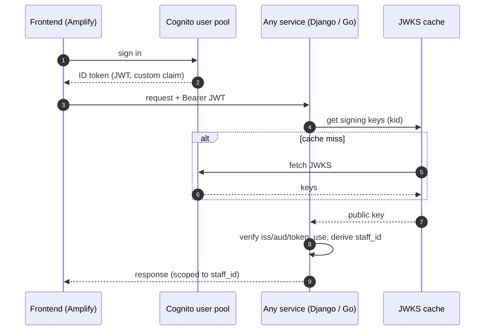

# 01. Full-Stack & Cognito SSO Auth / フルスタック構成とSSO認証

> One Cognito user pool identifies every staff member across a Next.js frontend, a Django API, and Go gateways — each service verifies the same ID token independently and derives a staff/examiner identity from a custom claim.
> 単一のCognitoユーザープールで、Next.jsフロント・Django API・Goゲートウェイの全体を横断してスタッフを識別。各サービスが同じIDトークンを独立に検証し、カスタムクレームからスタッフ/添削者IDを導出する。

関連スニペット: [go_gateway_handler.go](../snippets/go_gateway_handler.go) / [typed_api_hook.tsx](../snippets/typed_api_hook.tsx)

---

## 課題 / Problem

プラットフォームは3つの独立デプロイ（フロント・メインAPI・非同期サービス群）に分かれている。ここで問題になるのが**「誰が操作しているか」を全サービスで一貫して識別する**こと。サービスごとに別ログインを持たせると体験も運用も破綻するし、認証を1箇所に集約するとその1箇所が単一障害点かつ密結合の温床になる。答案は個人情報であり、「誰の操作か」を確実に紐付けられなければ監査もアクセス制御も成り立たない。

## 技術的な工夫 / Key engineering decisions

- **単一ユーザープール × 各サービス独立検証（SSO）**
  認証は1つのCognitoユーザープールに集約し、フロントはAWS AmplifyでサインインしてIDトークンを取得。以降は各サービスへ`Authorization: Bearer <JWT>`で送る。**検証は各サービスが独立に**行うため、認証サービスへの同期呼び出しがなく、疎結合のままSSOが成立する。

- **カスタムクレーム由来のスタッフ識別子**
  IDトークンのカスタムクレームから、スタッフ/添削者を一意に表す`staff_id`を導出（実データでは業務固有のクレーム名）。この1つの値で、メインAPIの権限判定・ADPALジョブの所有者スコープ・監査ログを串刺しにする。

- **JWKSキャッシュで検証コストを削減**
  トークン署名検証に必要なJWKS（公開鍵）は毎回取りに行かず、短TTL（例: 数分）でキャッシュ。`kid`で鍵を引き当て、`iss` / `aud` / `token_use=id` を厳格に突き合わせる。DjangoはDBキャッシュ、Goはプロセス内でキャッシュ。

- **ミドルウェア層での一元化**
  検証ロジックはアプリのビジネスコードに散らさず、Django/GoともにHTTPミドルウェアに寄せる。ヘルスチェックやWebhookなど認証不要な経路だけを明示的に除外し、それ以外は既定でJWT必須にする（fail-closed）。

- **人間 × サービス間の2系統**
  UI操作は人間のCognito JWT、パイプライン等のサービス間呼び出しはIAM認証で入口を分離。ADPALのジョブAPIは両系統から呼べるが、所有者スコープは常にスタッフIDを軸にする。

## 認証フロー / Auth flow

## 効果 / Impact

- 3サービスを跨いでも**1回のサインインで完結**し、スタッフを一意に識別できる
- 認証サービスへの同期依存がなく、各サービスが独立にスケール・デプロイ可能
- JWKSキャッシュで検証のレイテンシと外部呼び出しを削減
- 「誰の操作か」を全サービスで同じIDに正規化でき、権限・所有者スコープ・監査を一貫させられる
