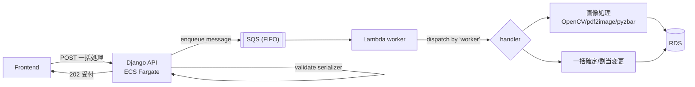

# 02. Async Offload (SQS → Lambda) / 重い処理の非同期化

> The Django REST API on ECS stays fast by pushing heavy work — answer-sheet image processing, bulk confirmations — onto a FIFO SQS queue consumed by Lambda workers.
> ECS上のDjango REST APIは、重い処理（答案画像処理・一括確定など）をFIFO SQSに投げ、Lambdaワーカーに実行させることで即応性を保つ。

関連スニペット: [sqs_lambda_worker.py](../snippets/sqs_lambda_worker.py) / [drf_serializer.py](../snippets/drf_serializer.py)

---

## 課題 / Problem

答案業務には、Webリクエストの数十秒〜数分では終わらない処理が多い。例えば答案PDFの画像化・位置合わせ・バーコード/QR読み取り（OpenCV / pdf2image / pyzbar）、あるいは数百〜数千枚の一括確定・添削者一括変更。これらを同期APIで処理すると、リクエストタイムアウト・ワーカースレッド枯渇・リトライ時の二重処理を招く。**「受け付けは速く、実処理は非同期に」**を業務に組み込む必要があった。

## 技術的な工夫 / Key engineering decisions

- **常時稼働コア × サーバーレスワーカーの分業**
  業務データとトランザクションを持つメインAPIはECS Fargateで常時稼働。CPU/メモリを食う画像処理や大量ループはLambdaワーカーへ委譲し、APIプロセスの応答性を守る。

- **FIFO SQS ＋ 重複排除**
  APIは処理要求をFIFO SQSへenqueueして即座にレスポンス。`MessageGroupId`で順序境界を、`MessageDeduplicationId`で重複投入を制御し、再送に強い（at-least-once前提でも二重実行を抑える）。

- **`worker`キーによるハンドラ・ディスパッチ**
  1つのワーカー・エントリポイントがメッセージ本文の`worker`種別を見て、対応するハンドラ関数へ振り分ける。ハンドラを1つ足すだけで新しい非同期ジョブ種別を追加でき、Lambdaを増やさずに拡張できる。

- **型付きイベントで境界を固める**
  SQSイベントは生dictのまま扱わず、型付きモデル（Pydantic的なスキーマ）へパースしてからハンドラに渡す。必須フィールド欠落や型不一致を処理の入口で弾き、ワーカー内部を安全にする（[sqs_lambda_worker.py](../snippets/sqs_lambda_worker.py) 参照）。

- **API境界のバリデーションはDRFシリアライザ**
  enqueue前の入力検証はDRFシリアライザに集約し、不正な要求はそもそもキューに載せない（[drf_serializer.py](../snippets/drf_serializer.py) 参照）。

- **コンテナLambdaでネイティブOpenCV依存を同梱**
  OpenCV/zbar等のネイティブ依存はコンテナイメージ（ECR）でパッケージし、実行環境差異をなくす。

## フロー / Flow

## 効果 / Impact

- 重い処理をキューに逃がし、APIのレスポンスタイムとワーカー枯渇リスクを解消
- FIFO＋重複排除 IDで、再送・障害時の二重処理を抑制
- `worker`ディスパッチにより、Lambda関数を増やさず非同期ジョブ種別を追加可能
- 型付きイベント＋シリアライザ検証で、不正データがワーカー内部まで到達しない
