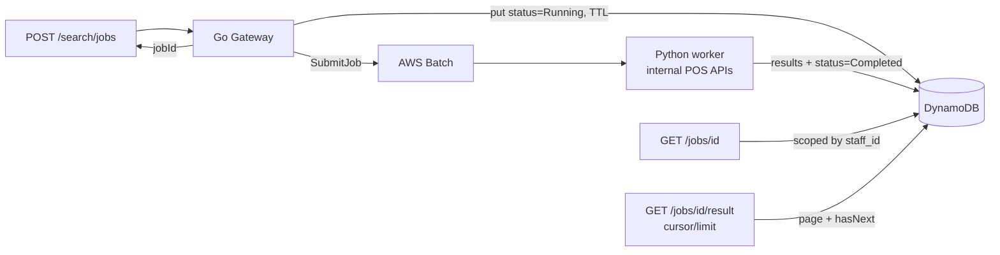

# 03. ADPAL — Async Search & Return / 非同期答案検索・返却

> ADPAL is a submit-poll-fetch job service: a Go API gateway (clean architecture) accepts a search/return job, runs it on AWS Batch, tracks state and results in DynamoDB, and hands them back through cursor-paginated endpoints.
> ADPALは「投入→ポーリング→取得」型のジョブサービス。Go製APIゲートウェイ（clean architecture）が検索/返却ジョブを受け付け、AWS Batchで実行し、状態と結果をDynamoDBで管理して、カーソルページングで返す。

関連スニペット: [go_gateway_handler.go](../snippets/go_gateway_handler.go)

---

## 課題 / Problem

答案の検索・返却は、条件によっては大量の答案を内部POS API経由で走査する必要があり、数分〜数十分かかる。これを同期HTTPで返すのは不可能で、かといってスタッフには「投げて、しばらくして結果を見る」という自然な操作感を提供したい。加えて、答案は個人情報なので**投入者本人しか結果を見られない**所有者スコープが必須だった。

## 技術的な工夫 / Key engineering decisions

- **ジョブAPIパターン（submit → poll → fetch）**
  `POST /v1/search/jobs`でジョブを投入するとゲートウェイは即座にジョブIDを返す。実処理はAWS Batchが担い、クライアントは`GET .../jobs/{id}`でステータスをポーリング、完了後に`GET .../jobs/{id}/result`で結果を取得する。HTTPのタイムアウトから長時間処理を完全に切り離す。

- **AWS Batch で長時間ワーカーを実行**
  検索/返却の実体はPythonバッチワーカー（内部POS APIを叩き、レスポンスを解析）。ジョブ定義・キューを環境変数で受け、ゲートウェイは`SubmitJob`するだけ。時間もリソースも読めない処理をLambdaの制約から外し、Batchに載せる。

- **DynamoDBをジョブ台帳に（TTL付き）**
  ジョブの状態と検索結果はDynamoDBに保存。TTLで自動失効させ、個人情報を必要以上に残さない。HTTP層とワーカー層はこの台帳だけで疎結合に連携する。

- **Clean architecture（handler / usecase / domain / repository）**
  Goゲートウェイは層を明確に分離。HTTPハンドラはI/O変換に徹し、ビジネスロジックはusecase、AWS依存（DynamoDB/Batch）はrepository/client実装に隔離。差し替え・テストが容易で、検索と返却で同じ骨格を再利用する。

- **OpenAPI駆動の型生成**
  APIはOpenAPI仕様を単一の真実とし、`oapi-codegen`でリクエスト/レスポンス型とハンドラI/Fを生成。仕様とコードのズレを防ぎ、フロントの型付きクライアントとも整合させる。

- **所有者スコープ ＆ 2系統認証**
  ジョブは投入者の`staff_id`（Cognitoクレーム由来）に紐付け、取得も同IDでスコープ。人間はCognito JWT、自動返却パイプラインからはIAM（`caller_id`）でも同じジョブAPIを呼べる。

- **カーソルページング**
  結果は`cursor`/`limit`で分割し、`hasNext`/`total`を返す。数千枚規模でもメモリ・転送量を抑える。

## ジョブライフサイクル / Job lifecycle

## 効果 / Impact

- 長時間処理をHTTPから切り離し、スタッフに「投げて後で見る」自然な操作を提供
- AWS Batchで時間・リソース読めない処理を安定実行、ゲートウェイは軽量なまま
- DynamoDB＋TTLで状態管理と個人情報の自動失効を両立
- clean architecture＋OpenAPI型生成で、検索/返却の実装を共通化しつつ型安全を担保
