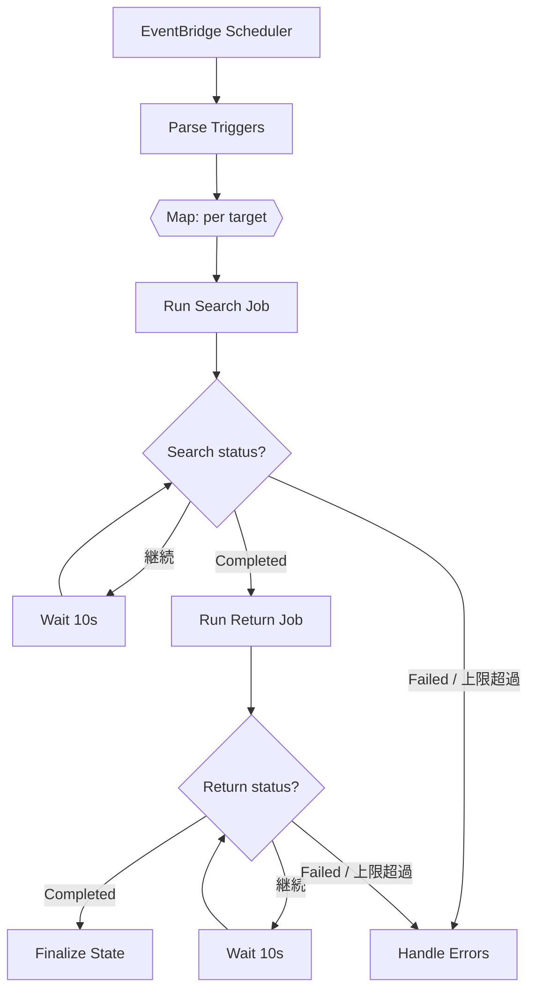

# 04. Auto-Return Pipeline / 自動返却パイプライン

> An event-driven AWS Step Functions state machine runs the full "search → return" flow unattended: Map fan-out per target, poll-until-done with bounded retries, and a dedicated error path — kicked off periodically by EventBridge.
> イベント駆動のAWS Step Functions state machineが「検索→返却」の一連を無人で実行。対象ごとの`Map`並列、完了までのポーリング（リトライ上限付き）、専用エラーパスを備え、EventBridgeで定期起動する。

関連スニペット: [step_functions_module.tf](../snippets/step_functions_module.tf)

---

## 課題 / Problem

答案の返却は本来スタッフが手動で回す作業だが、条件に合致する答案は定期的に自動で返したい。ただし対象は複数（チーム/条件単位）で、各々が長時間の検索・返却ジョブを伴う。ここで難しいのは、**一部が失敗しても全体を止めない**こと、**長時間処理を待ち切る**こと、そして**どこで何が起きたかを後から追える**ことを、無人運転で成立させる点だった。

## 技術的な工夫 / Key engineering decisions

- **Step Functionsで宣言的にオーケストレーション**
  「検索ジョブ投入 → 完了待ち → 返却ジョブ投入 → 完了待ち → 確定」という手順を、Go製Lambda群をつなぐstate machineとして定義。制御フローをコードではなくステートマシン定義に持たせ、実行履歴でそのまま可視化する。

- **`Map`で対象ごとに並列・独立実行**
  `Parse Triggers`が対象リスト（Items）を生成し、`Map`で各対象を並列展開。1対象の失敗は他に波及せず、`Catch`でその対象だけをエラー処理に落とす。

- **`Wait` + `Choice`によるポーリング（リトライ上限付き）**
  検索/返却は非同期ジョブなので、`Wait`（10秒）→ステータス取得Lambda→`Choice`で `Completed` / `Failed` / 継続 を判定。リトライ回数を状態に持ち、上限（例: 180回 ≒ 約30分）を超えたらエラーに遷移して無限ループを防ぐ。

- **全Taskに`Retry`（指数バックオフ）＋`Catch`**
  各Lambda呼び出しに`Retry`（`IntervalSeconds`＋`BackoffRate`、最大試行回数）を付け、一時障害を吸収。恒久的な失敗は`Catch`で共通の`Handle Errors`に集約し、`Finalize State`と対にして必ず終端させる。

- **EventBridge Schedulerで定期・無人起動**
  起動トリガはEventBridge。トリガ時刻の解釈は`Parse Triggers` Lambda（cronパース）に閉じ込め、対象生成のロジックを1箇所に集約する。

- **ジョブ実行は既存ADPALを再利用**
  検索/返却の実処理はADPALのジョブAPI（feature 03）を呼ぶだけ。パイプラインは「調整役」に徹し、実処理は共通化する。

- **Terraformで定義を注入（マルチ環境）**
  state machine定義は`templatefile`でLambda名などを環境ごとに差し込み、`aws_sfn_state_machine`へ渡す（[step_functions_module.tf](../snippets/step_functions_module.tf) 参照）。dev/stg/prodで同一構成を再現する。

## state machine（抜粋）/ excerpt

## 効果 / Impact

- 定期的な自動返却を無人で実行し、手作業の運用負荷を削減
- `Map`並列＋`Catch`で、一部対象の失敗が全体を止めない耐障害性
- `Wait`/`Choice`＋リトライ上限で、長時間ジョブを安全に待ち切りつつ無限ループを回避
- 実行履歴がそのまま監査・障害調査の材料になり、どのステップで何が起きたか追跡できる
