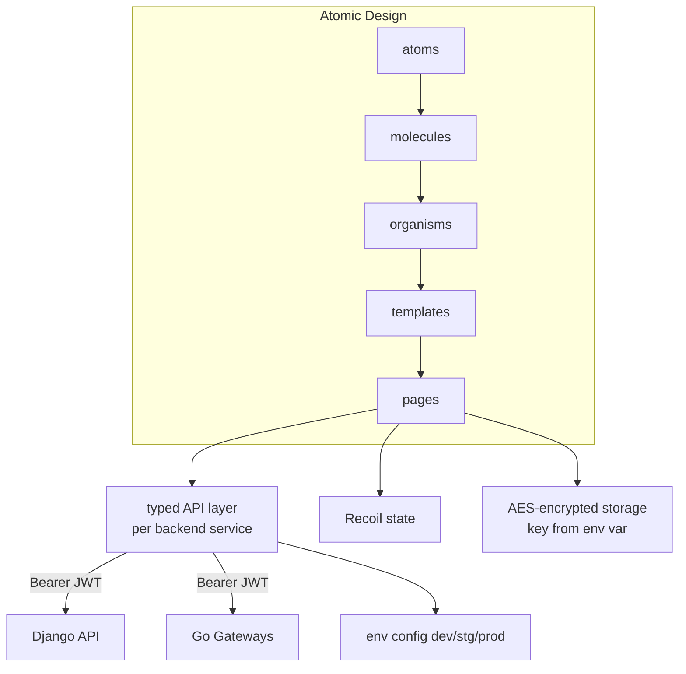

# 05. Frontend Architecture / フロントエンド設計

> A staff-facing Next.js / TypeScript SPA built on Atomic Design and Storybook, with a per-service typed API layer, environment-based config, and AES-encrypted local storage for sensitive values.
> Atomic DesignとStorybookを土台にしたスタッフ向けNext.js / TypeScript製SPA。サービスごとの型付きAPI層、環境別設定、機密値のAES暗号化ローカルストレージを備える。

関連スニペット: [typed_api_hook.tsx](../snippets/typed_api_hook.tsx)

---

## 課題 / Problem

このフロントは複数の業務ドメイン（答案検索・返却、自動返却設定、各種社内業務）を1つのアプリで扱う。画面数と状態が多く、放置すると巨大なコンポーネントとコピペAPI呼び出しでカオス化する。さらに、2つのバックエンド（Django API・Goゲートウェイ）それぞれと型を合わせて通信し、CognitoのIDトークンを毎リクエストに載せ、一部の機密値をブラウザに安全に保持する必要があった。

## 技術的な工夫 / Key engineering decisions

- **Atomic Designでコンポーネントを段階化**
  `atoms / molecules / organisms / templates`の階層でUIを構成。再利用単位を明確にし、画面（pages）はtemplatesの組み合わせに寄せることで、業務ドメインが増えても破綻しにくくする。

- **Storybookでカタログ化・単体確認**
  コンポーネントをStorybookで独立に確認・レビュー。バックエンド無しでもUIの状態バリエーションを検証でき、Jest + Testing Libraryのテストと合わせて品質を担保する。

- **サービス別の型付きAPI層**
  API呼び出しは画面に直書きせず、バックエンドのサービス単位（例: メインAPI／自動返却）でクライアントを分離。axiosベースの薄いラッパにリクエスト/レスポンス型を付け、認証トークン付与とエラーハンドリングを共通化する（[typed_api_hook.tsx](../snippets/typed_api_hook.tsx) 参照）。

- **環境別設定を1箇所に集約**
  dev/stg/prodのエンドポイントや定数は環境設定モジュールに集約し、ビルド時の環境変数で切り替え。ハードコードされたURLをコード中に散らさない。

- **状態管理はRecoilとReact Hook Form**
  横断的なクライアント状態はRecoil、フォームはReact Hook Formで局所化。過剰なグローバル状態を避け、再レンダリングを抑える。

- **機密値はAES暗号化して保存**
  ブラウザに一時保持する必要がある機密値は、`crypto-js`のAESで暗号化してからローカルストレージへ。**暗号鍵はソースに直書きせず環境変数から解決**し、平文での保存・ソースへの鍵混入を避ける（本ポートフォリオのサンプルもこの方針で書き起こしている）。

- **静的書き出し ＋ Amplify Hosting**
  Next.jsの静的出力をAmplify Hostingで配信。CI（Lint/型チェック/テスト）とpre-commit（Husky/lint-staged）で、マージ前に品質ゲートを通す。

## 構成 / Layering

## 効果 / Impact

- 複数業務ドメインを1アプリで扱っても、Atomic Design＋型付きAPI層で保守性を維持
- Storybook＋Jestでバックエンド非依存にUIを検証でき、レビュー効率が向上
- 環境別設定の集約で、URL等のハードコードとデプロイ時の取り違えを防止
- 機密値をAES暗号化＋環境変数鍵で扱い、平文保存・鍵のソース混入を回避
