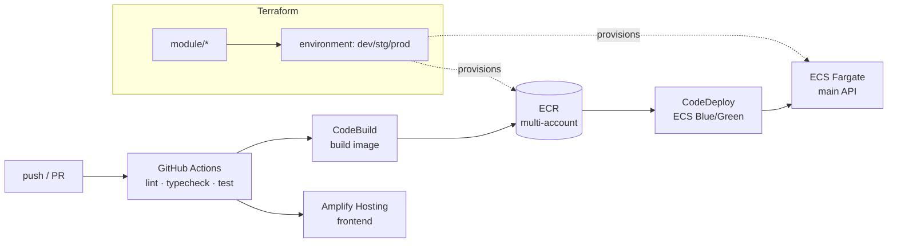

# 06. IaC & CI/CD / インフラと継続デリバリ

> The whole platform is provisioned with reusable Terraform modules and per-environment stacks, and shipped through GitHub Actions + CodeBuild/CodeDeploy, with images distributed across a multi-account ECR setup.
> プラットフォーム全体を、再利用可能なTerraformモジュールと環境別スタックでプロビジョニングし、GitHub Actions + CodeBuild/CodeDeployでデリバリ。イメージはマルチアカウントECRで配布する。

関連スニペット: [step_functions_module.tf](../snippets/step_functions_module.tf)

---

## 課題 / Problem

このプラットフォームは3デプロイ・多数のAWSサービス（ECS/Lambda/API Gateway/SQS/Batch/Step Functions/EventBridge/DynamoDB/Cognito/RDS/S3/ECR/VPC…）にまたがり、しかもdev/stg/prodの複数環境で動く。手作業やコンソール操作では再現性が保てず、環境差異（設定ドリフト）や本番事故の温床になる。**「同じ構成を、環境ごとに、宣言的に、レビュー可能に」**再現する仕組みが必要だった。

## 技術的な工夫 / Key engineering decisions

- **Terraformをmodule ＋ environmentに分離**
  再利用可能な部品（`vpc` / `subnet` / `security-group` / `ecs`相当 / `lambda` / `apigateway` / `batch` / `step-functions` / `dynamodb` / `eventbridge` / `cognito` / `ecr` / `iam` / `s3` / `acm` / `route53`）を`module/`に置き、`environment/`の環境別スタックから変数を渡して組み立てる。1つの構成変更が全環境に一貫して反映される。

- **環境ごとの差し込み（templatefile）**
  Step Functions定義やLambda名などの環境依存値は`templatefile`で注入し、`aws_sfn_state_machine`等へ渡す。定義本体は共通、可変部だけを環境変数化する（[step_functions_module.tf](../snippets/step_functions_module.tf) 参照）。

- **秘密情報をコードから排除**
  認証情報・接続先は`.tfvars`（gitignore）やSSM/Secrets参照で解決し、`.tfstate`も含めてリポジトリに平文を残さない。IAMは最小権限で組み、ロール/ポリシーをモジュール化する。

- **ECS Blue/Greenデプロイ（CodeBuild/CodeDeploy）**
  メインAPIは`buildspec`でビルド、`taskdef`/`appspec`でECSへBlue/Greenデプロイ。切り替え前に新タスクを検証してから寄せることで、無停止・ロールバック可能なリリースにする。

- **GitHub Actionsで品質ゲート**
  PRでLint（ruff/ESLint/golangci-lint）・型チェック・テスト（pytest/Jest/go test）を実行し、通過を必須化。マージからデプロイまでを自動でつなぐ。

- **マルチアカウントECR**
  コンテナイメージはアカウントを跨いで配布する構成。ビルド用/実行用のアカウント境界を越えてイメージを共有し、環境分離とイメージ再利用を両立する。

- **フロントはAmplify Hosting**
  静的書き出ししたNext.jsをAmplifyでビルド・配信し、バックエンドのデプロイ経路と分離する。

## デリバリ経路 / Delivery path

## 効果 / Impact

- module＋環境別スタックで、3デプロイ・複数環境を再現性高く・レビュー可能にプロビジョニング
- Blue/Greenデプロイで無停止リリースとロールバックを実現
- CIの品質ゲートで、Lint/型/テスト未通過のコードを本番経路に乗せない
- 秘密情報をコード/stateから排除し、最小権限IAMと合わせて公開・運用リスクを低減
