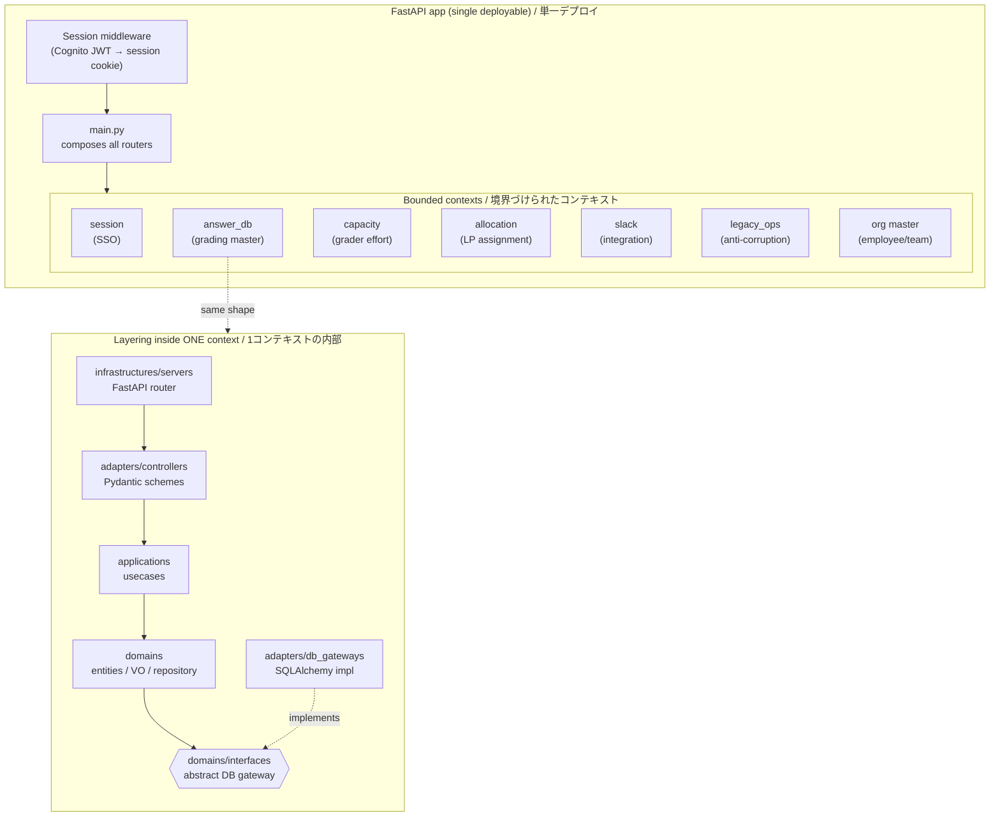
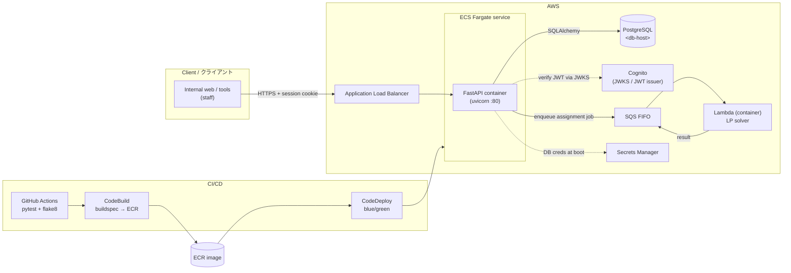
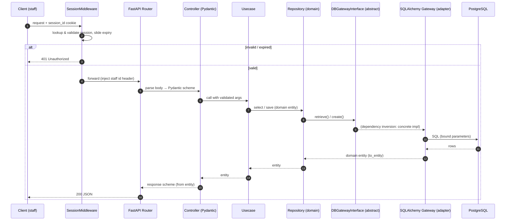

# Architecture / アーキテクチャ

All identifiers below (account IDs, ARNs, hostnames, resource names) are **placeholders**. This document describes the system shape and the reasoning behind each design decision.
以下の識別子（アカウントID・ARN・ホスト名・リソース名）はすべて**プレースホルダ**です。本書ではシステムの構成と各設計判断の「なぜ」を説明します。

---

## 1. Modular monolith — bounded contexts & layering / モジュラーモノリスと層構造

A single FastAPI application is partitioned into independent **bounded contexts**. Every context repeats the same clean-architecture layering, and the arrows in the *inner* box show the dependency direction: everything points **inward** to the domain, and the domain depends only on **abstract interfaces** that adapters implement (dependency inversion).

単一のFastAPIアプリを独立した**境界づけられたコンテキスト**に分割。各コンテキストは同じ層構造を繰り返し、内側の箱の矢印は依存方向（すべてドメインへ内向き、ドメインは抽象インターフェースにのみ依存＝依存性逆転）を示します。

**Why this shape / なぜこの構成か**
- **Modular monolith, not microservices:** 単一チーム・単一DBの規模では、ネットワーク分割・分散トランザクション・運用多重化のコストが利益を上回る。境界だけは明確に保ちつつ、デプロイは1つに集約して運用を単純化。
- **Bounded contexts:** ドメインごとにモデル・語彙・スキーマを閉じ、変更の影響範囲を局所化。将来サービス分割が必要になっても、境界が既にあるため切り出しやすい。
- **Uniform layering:** すべてのコンテキストが同じ4層（domain / application / adapter / infrastructure）を繰り返すため、認知負荷が低く、新規コンテキストの追加コストが小さい。
- **Dependency inversion:** ドメインは抽象インターフェースにのみ依存し、SQLAlchemyやSlack SDKといった詳細を知らない。DBやフレームワークの差し替えがドメインに波及しない。

---

## 2. Request & deploy flow / リクエストとデプロイの流れ

**Why this shape / なぜこの構成か**
- **ECS Fargate over Lambda for the API:** 常時稼働・ミドルウェア（セッション）・DBコネクション保持がある長寿命APIには、コンテナ常駐のFargateが素直。サーバ管理は不要のままスケール。
- **Secrets at boot, not in image:** DB認証情報などはSecrets Managerから起動時に環境変数へ展開（コンテナのentrypointでJSONをパース）。イメージやコードに秘匿値を焼き込まない。
- **Cognito for staff identity:** IdPを自前実装せず、Cognitoの署名付きJWT（RS256）をJWKSで検証。鍵ローテーションにも追従。
- **Async offload to Lambda:** 重い線形計画ソルバ（CBC）はAPIプロセスから切り離し、SQS FIFO経由でコンテナLambdaに委譲。APIのレイテンシとリソースを守る。
- **Blue/green deploy:** CodeDeployでタスク定義を切替。無停止デプロイと即時ロールバックを確保。

---

## 3. Authenticated request flow (clean-architecture crossing) / 認証付きリクエストの層通過

One request crossing every layer: the session middleware authenticates, then a controller → usecase → domain-interface → adapter path handles the business call.

1リクエストが全層を横断する様子。セッションミドルウェアが認証し、続いて コントローラ → ユースケース → ドメインインターフェース → アダプタ の経路で業務処理を行います。

**Why this shape / なぜこの構成か**
- **Auth as middleware, not per-route:** セッション検証を横断的関心事としてミドルウェアに集約。各ルートは業務ロジックに集中でき、認証漏れを構造的に防ぐ（公開パスは除外リストで明示）。
- **Pydantic only at the boundary:** リクエスト／レスポンスの妥当性検証はコントローラ層に閉じ、内側はドメインの型（`dataclass`）で扱う。フレームワーク型がドメインへ漏れない。
- **Interface between usecase and DB:** ユースケースは抽象ゲートウェイ越しにしかDBを触らない。テストではフェイクを注入し、DBなしで振る舞いを検証できる。
- **Entity ⇄ row mapping in the adapter:** `from_entity` / `to_entity` でORMモデルとドメインエンティティを相互変換し、DBスキーマの都合をドメインへ持ち込まない。

---

## Cross-cutting concerns / 横断的関心事

- **Type safety / 型安全:** API境界は Pydantic `BaseModel`＋`Field`（説明・例つき）で検証、ドメインは `dataclass`（Value Object は `frozen=True`）。`mypy`（`ignore_missing_imports`）で静的検査。
- **Testing / テスト:** `pytest` によるユニット中心の戦略。抽象ゲートウェイのおかげでインメモリのフェイクを注入でき、DB非依存でユースケース／ドメインを検証。E2Eも一部併用。GitHub Actionsで自動実行。
- **Security / セキュリティ:** Cognito JWT を JWKS で検証（`aud`/`iss`/`exp`/`sub` を確認）、短命セッションCookie。SQLはSQLAlchemyでプレースホルダバインディング。秘匿値はSecrets Manager／環境変数参照のみ（コードに値を持たない）。CORSは許可オリジンを正規表現で限定。
- **Observability / 可観測性:** コンテナ標準出力を CloudWatch Logs（`awslogs` ドライバ）へ集約。ヘルスチェック（`/healthz`）でロードバランサ／デプロイの死活監視。
- **CI/CD:** GitHub Actions が `pytest` と `flake8`（`max-line-length=120`）を実行。CodeBuild（`buildspec`）が ECR にイメージを push し、CodeDeploy が ECS のタスク定義を blue/green で切替。
