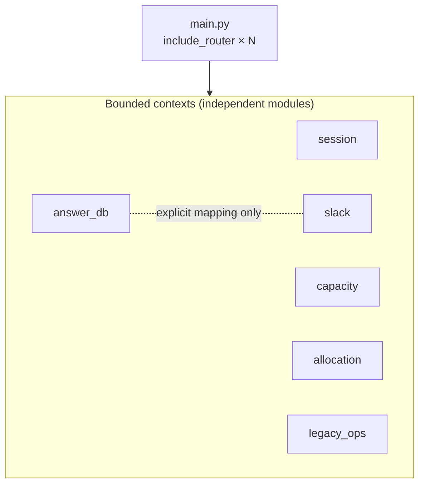

# 01. Modular Monolith / モジュラーモノリス構成

> One FastAPI deployable, partitioned into independent bounded contexts — microservice-like modularity with monolith-like operational simplicity.
> 単一のFastAPIデプロイを、独立した「境界づけられたコンテキスト」に分割。マイクロサービス的な疎結合と、モノリス的な運用の単純さを両立。

関連スニペット: [application_usecase.py](../snippets/application_usecase.py)

---

## 課題 / Problem

社内の業務チームには、認証・答案添削のマスタ管理・添削者の可能工数・割当最適化・Slack連携・レガシー基幹連携など、性質の異なる複数の機能が必要でした。これを機能ごとに別サービス（別リポジトリ・別デプロイ・別DB）へ分割すると、少人数のチームには**ネットワーク境界・分散トランザクション・監視/デプロイの多重化**という運用コストが重くのしかかります。一方で、単一の巨大なアプリに全部を混ぜると、ドメイン同士が密結合して変更が波及します。

The team needed several distinct capabilities. Splitting into many microservices would impose network boundaries, distributed transactions, and multiplied ops overhead on a small team; a single tangled app would let domains bleed into each other.

## 技術的な工夫 / Key engineering decisions

- **モジュラーモノリスの選択**
  デプロイ単位は1つ（FastAPIコンテナ）に保ちつつ、内部を**境界づけられたコンテキスト**（`session` / `answer_db` / `capacity` / `allocation` / `slack` / `legacy_ops` / 組織マスタ）に分割。各コンテキストは自分のドメインモデル・スキーマ・語彙を閉じて持つ。

- **コンテキスト = 独立モジュール**
  各コンテキストは同じ構造（`domains` / `applications` / `adapters` / `infrastructures`）を持ち、他コンテキストの内部実装に依存しない。相互作用が必要な箇所は明示的な変換サービス（例: 業務セグメント ↔ Slackチャンネルのマッピング）に限定。

- **合成ルートと単一の起動点**
  各コンテキストの `__init__.py` が「ゲートウェイ→ユースケース→コントローラ→ルーター」を結線し、`main.py` が全ルーターを `include_router` で束ねる。依存関係の組み立てが一箇所に集約され、追跡が容易。

- **将来のサービス分割に開いた構造**
  境界とインターフェースが最初から明確なので、あるコンテキストの負荷が突出した場合でも、そのモジュールだけを切り出してサービス化しやすい（実際、割当最適化は重いソルバ処理だけを非同期Lambdaへオフロード済み）。

## 構成イメージ / Shape

## 効果 / Impact

- 単一デプロイ・単一DBで**運用をシンプル**に保ちつつ、ドメイン境界で**変更の影響範囲を局所化**
- すべてのコンテキストが同じ層構造なので、**新機能の追加コストと学習コストが低い**
- 境界が明確なため、必要になった部分だけを**段階的にサービス分割**できる（YAGNIに沿った進化）
