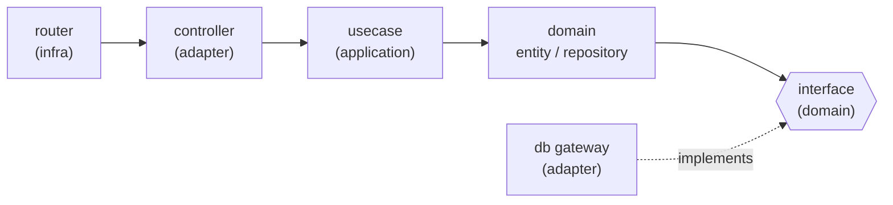

# 02. Clean Architecture & DDD / クリーンアーキテクチャとDDDレイヤリング

> Every context is layered domain / application / adapter / infrastructure, with dependencies inverted so the domain never knows the database or the framework.
> 各コンテキストを domain / application / adapter / infrastructure に層分割し、依存を逆転。ドメインはDBもフレームワークも知らない。

関連スニペット: [domain_models.py](../snippets/domain_models.py) / [repository_and_gateway.py](../snippets/repository_and_gateway.py) / [router_and_controller.py](../snippets/router_and_controller.py)

---

## 課題 / Problem

業務ロジック（例: 添削者の可能工数集計、答案の割当条件）がSQLAlchemyやFastAPIに直接依存すると、DBスキーマやフレームワークの都合が業務ルールに漏れ込み、テストも実DB前提になって遅く・脆くなります。ドメインの本質的な複雑さと、技術詳細の複雑さを**分離**する必要がありました。

When business rules depend directly on the ORM or the web framework, database and framework concerns leak into the domain and tests require a real DB. The essential complexity of the domain had to be separated from technical detail.

## 技術的な工夫 / Key engineering decisions

- **4層のレイヤリング**
  - `domains` — Entity / Value Object、Repository、Specification、Builder、そして**抽象インターフェース**（`interfaces/`）
  - `applications` — ユースケース（ドメインを協調させるアプリケーションサービス）
  - `adapters` — コントローラ（Pydanticスキーマ）と DBゲートウェイ（SQLAlchemy実装）
  - `infrastructures` — FastAPIルーター、Lambdaハンドラ等の外界

- **依存性逆転（DIP）**
  ドメインは `domains/interfaces` に抽象ゲートウェイ（`abc.ABCMeta`）を定義し、`adapters/db_gateways` の SQLAlchemy 実装がそれを `implements`。Repository は抽象型のクラス属性を保持し、ユースケースが具体実装を注入する。**依存の矢印は常にドメインへ内向き**（→ [repository_and_gateway.py](../snippets/repository_and_gateway.py)）。

- **戦術的DDDパターンの使い分け**
  - **Value Object**（`frozen=True` の `dataclass`）: 校舎/支部・科目・添削者IDなど不変の値
  - **Entity**: 試験種など同一性を持つオブジェクト
  - **Repository**: 永続化の抽象（`select_by` / `save` / `delete`）
  - **Specification**: 検索条件をオブジェクトとして表現し、コレクションを絞り込む
  - **Builder**: 生成（`new`）と再構築（`reconstruct_from`）を分けたエンティティ組み立て
  - **DTO⇄Entity マッパー**: ORMモデルの `from_entity` / `to_entity`

- **Pydanticは境界だけ**
  リクエスト／レスポンスの検証はコントローラ層の Pydantic スキーマに閉じ、内側はドメインの `dataclass` に変換して扱う。フレームワーク型がユースケースやドメインへ侵入しない（→ [router_and_controller.py](../snippets/router_and_controller.py)）。

## レイヤの依存方向 / Dependency direction

## 効果 / Impact

- ドメインが**フレームワーク非依存**になり、DBやライブラリの差し替えがビジネスルールへ波及しない
- 抽象インターフェースの継ぎ目で**フェイクを注入**でき、DBなしの高速なユニットテストが可能（→ [features/03](03-type-safety-and-testing.md)）
- 全コンテキストで**同一の層構造**が反復されるため、コードの見通しと保守性が高い
