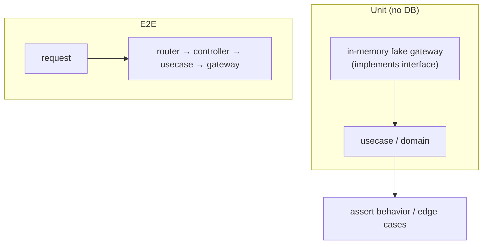

# 03. Type Safety & Testing / 型安全とテスト戦略

> Pydantic at the API boundary, `mypy` / `flake8` in CI, and fast DB-less unit tests made possible by injecting in-memory fake gateways at the interface seams.
> API境界はPydantic、CIで`mypy`/`flake8`、そしてインターフェースの継ぎ目にインメモリのフェイクを注入したDB非依存の高速なユニットテスト。

関連スニペット: [router_and_controller.py](../snippets/router_and_controller.py) / [repository_and_gateway.py](../snippets/repository_and_gateway.py)

---

## 課題 / Problem

複数のコンテキストが同居するモジュラーモノリスでは、境界での**型崩れ**や**リグレッション**が全体に波及しかねません。かといって、あらゆるユースケースを実DBに繋いでテストすると、遅く・環境依存で・壊れやすいテストになります。**速く・決定的で・意味のある**テストと、継続的な型検査が必要でした。

In a modular monolith, type drift and regressions at the boundaries can ripple everywhere; yet wiring every test to a real database yields slow, environment-dependent, brittle tests.

## 技術的な工夫 / Key engineering decisions

- **境界の型検証（Pydantic）**
  リクエスト／レスポンスは Pydantic `BaseModel`＋`Field`（`description` / `example` 付き）で定義。不正な入力は境界で弾き、OpenAPIドキュメントも自動生成。内側はドメインの `dataclass` に変換して扱う。

- **静的解析をCIに常設**
  `mypy`（`ignore_missing_imports`）で型検査、`flake8`（`max-line-length=120`、migrations除外）でスタイル/静的検査。GitHub Actions が push / PR で `pytest` と `flake8` を自動実行する。

- **フェイク差し替えによるユニットテスト**
  ドメインが抽象ゲートウェイにしか依存しないため、テストでは**インメモリのフェイクゲートウェイ**（辞書ベースの実装）を注入。DBを立てずにユースケース・ドメインの振る舞いを検証でき、テストが高速・決定的になる。

- **テストのレイヤ対応**
  `domains`（Builder・集計ロジック）、`applications`（ユースケース）、`adapters/controllers`（入出力変換）と、レイヤごとにテストを配置。加えて主要フローには E2E テストも用意し、層をまたいだ結線を確認。

- **境界値・異常系の網羅**
  可能工数の期間集計では、未登録日のスキップ・期間外・開始/終了日の逆転（`AssertionError`）・存在しないID（`NotFoundError`）といった**境界値と異常系**を明示的にテスト。

## テストの構造 / Test shape

## 効果 / Impact

- 境界のPydantic検証で**不正入力を早期に遮断**、API仕様も自動ドキュメント化
- フェイク注入により**DB非依存で高速・決定的なテスト**を実現、CIで継続的に担保
- 型検査＋Lintの常設で、モジュラーモノリス全体の**リグレッションを抑制**
