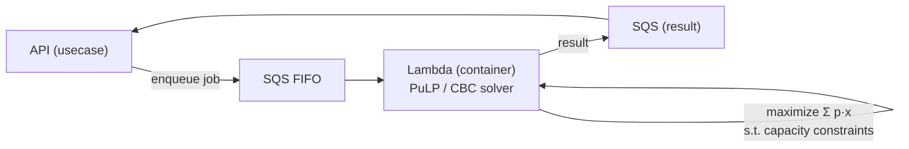

# 04. Operations Integration / 運用連携

> Internal-API integrations that connect the platform to the team's day-to-day tools: a typed Slack façade, an anti-corruption façade over a legacy operations console, and an asynchronous linear-programming assignment engine.
> プラットフォームをチームの日常業務ツールへ接続する内部API群。型付きSlackファサード、レガシー運用コンソールへの腐敗防止ファサード、非同期の線形計画割当エンジン。

関連スニペット: [application_usecase.py](../snippets/application_usecase.py)

---

## 課題 / Problem

業務の実態は、外部SaaS（Slack）や既存の**レガシー運用コンソール**、そして人手に頼っていた**答案と添削者の割当**に散らばっていました。これらを内部APIとして安全に取り込むには、外部の都合（SDKの例外体系、レガシー画面の仕様、重いソルバ処理）を**ドメインに漏らさない**設計が必要でした。

Operations were spread across an external SaaS (Slack), a legacy operations console, and a manual answer-to-grader assignment process. Absorbing these as internal APIs required keeping external concerns — SDK exceptions, legacy quirks, heavy solver work — out of the domain.

## 技術的な工夫 / Key engineering decisions

- **型付きSlackファサード**
  チャンネル作成・招待・テキスト／リッチテキスト投稿・ファイルアップロードを、単一のファサードにまとめて隠蔽。Slack SDK の生の例外（`missing_scope` / `channel_not_found` / `not_in_channel` / `already_in_channel` 等）を**ドメイン例外へ翻訳**し、呼び出し側は業務語彙だけで扱える。個人チャンネル／業務チャンネルの投稿先は、`team ↔ token`・`業務セグメント ↔ チャンネル`・`メンバー ↔ 個人チャンネル`のマッピングを変換サービスで解決。

- **レガシー基幹への腐敗防止ファサード（ACL）**
  外部の運用コンソール（受領答案の検索・添削者変更・答案返却・上限件数設定）を、`facade` 層のアダプタで包む。**リトライ付きの操作ラッパ**で不安定な外部操作を吸収し、外部のデータ形式はドメインのValue Object／DTOへ変換。レガシーのモデルが内部ドメインへ侵入しない。

- **線形計画（LP）による割当最適化**
  答案（依頼）と添削者を、**選好スコアを最大化**しつつ、各添削者の可能工数・各依頼の必要工数という**制約**の下で割り当てる問題を、PuLP（CBCソルバ）でモデル化。目的関数 `Σ p·x` を最大化し、添削者ごと・依頼ごとの容量制約を線形制約として付与。

- **重い処理の非同期オフロード**
  ソルバ実行はAPIプロセスから切り離し、**SQS FIFO → コンテナLambda** で非同期に処理して結果をキューへ返す。APIのレイテンシとメモリを保護し、スパイクにも耐える。

## 割当最適化の流れ / Assignment flow

## 効果 / Impact

- Slack／レガシー基幹の**外部依存をファサードに封じ込め**、ドメインを外部仕様の変化から保護
- 属人的だった割当を**最適化アルゴリズムで自動化**し、選好と工数制約を両立
- 重いソルバ処理を**非同期化**して、APIの応答性とリソースを安定化
