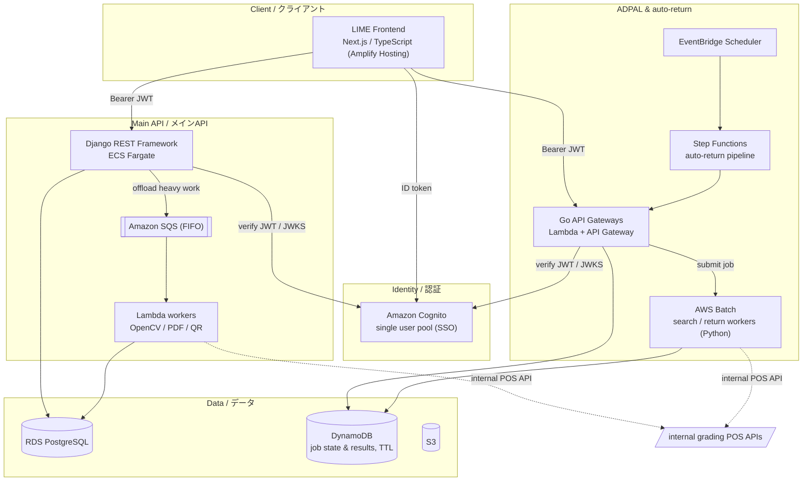
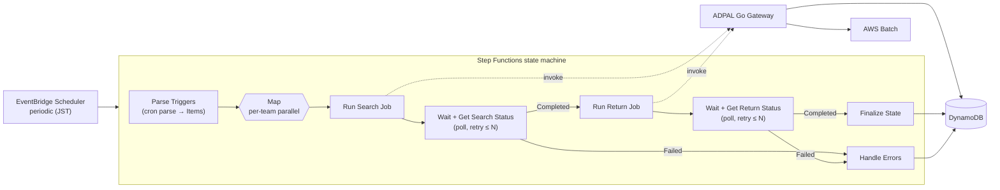
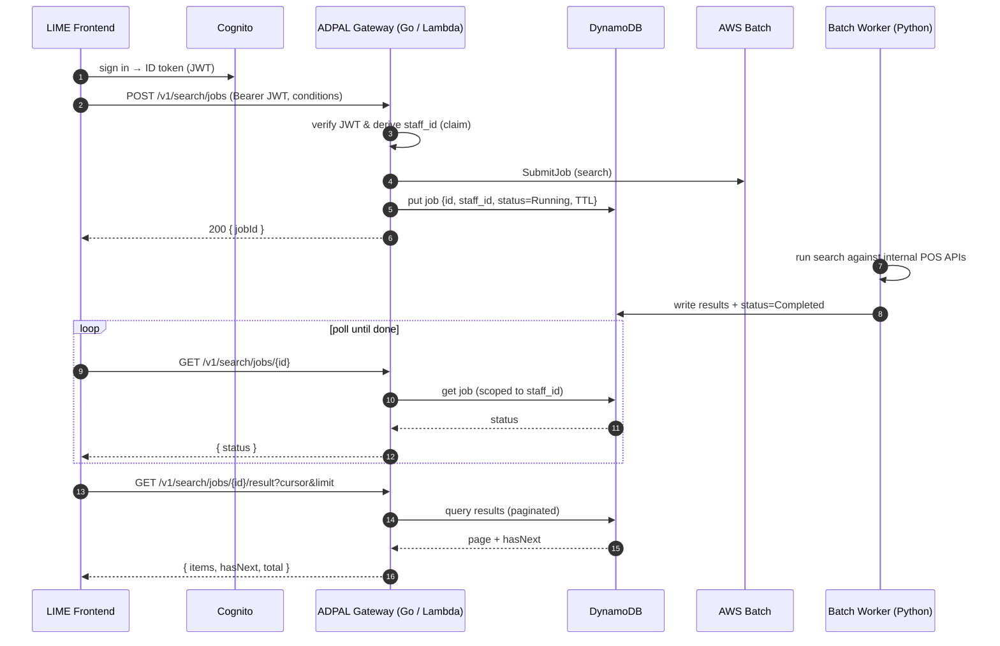

# Architecture / アーキテクチャ

All identifiers below (account IDs, endpoints, hostnames, ARNs, pool/client IDs) are **placeholders**. This document describes the system shape and the reasoning behind each design decision.
以下の識別子（アカウントID・エンドポイント・ホスト名・ARN・プール/クライアントID等）はすべて**プレースホルダ**です。本書ではシステムの構成と各設計判断の「なぜ」を説明します。

---

## 1. System overview / システム全体図

**Why this shape / なぜこの構成か**
- **One identity, three deployables:** フロント・メインAPI・非同期サービスを分離しつつ、認証だけは単一Cognitoプールに統一。各サービスは同じIDトークンを独立検証するので、二重ログインなしに横断的なスタッフ識別ができる。
- **ECS for the always-on core, serverless for spikes:** 業務データを持つメインAPIは常時稼働のECS Fargate、バースト的で重い処理はSQS→LambdaやAWS Batchに逃がし、Webリクエストを詰まらせない。
- **DynamoDB as the async job ledger:** 非同期ジョブの状態と結果はTTL付きDynamoDBに置き、HTTP層と長時間処理を疎結合にする（投入→ポーリング→取得）。
- **Internal POS APIs behind workers only:** 答案の実データにアクセスする内部POS APIは、ワーカー（Lambda/Batch）側からのみ叩き、公開APIから直接は触らせない。

---

## 2. Auto-return pipeline / 自動返却パイプライン（イベント駆動）

**Why this shape / なぜこの構成か**
- **Map fan-out:** 対象（チーム/条件）ごとに`Map`で並列展開し、1件の失敗が全体を止めないようにする。
- **Poll instead of block:** 検索/返却は長時間かかるため、`Wait`（10秒）＋ステータス取得Lambda＋`Choice`で完了/失敗/継続を判定。リトライ上限に達したらエラーへ。
- **Bounded retries + backoff on every task:** 各Taskに`Retry`（指数バックオフ・最大試行）を付け、一時障害を吸収。恒久障害は`Catch`で専用の`Handle Errors`に集約。
- **EventBridge for unattended runs:** 定期起動をEventBridge Schedulerに任せ、無人で回す。state machineの実行履歴がそのまま運用の可視化になる。

---

## 3. Async job request flow / 非同期ジョブのリクエストフロー（ADPAL 答案検索）

**Why this shape / なぜこの構成か**
- **Submit-then-poll:** 数分〜数十分かかる処理をHTTPリクエスト内で待たず、ジョブIDを即返してクライアントがポーリングする。タイムアウトと再試行に強い。
- **Staff-scoped access:** ジョブは投入者のスタッフID（Cognitoクレーム由来）に紐付け、取得時も同IDでスコープして他人のジョブを見せない。
- **Cursor pagination:** 結果は`cursor`/`limit`で分割取得し、`hasNext`/`total`を返す。大量の答案でもメモリと転送量を抑える。
- **Two auth modes:** 人間（Cognito JWT）とサービス間（IAM）で入口を分け、自動返却パイプラインからも同じジョブAPIを呼べるようにする。

---

## Cross-cutting concerns / 横断的関心事

- **Type safety / 型安全:** フロントはTypeScript、メインAPIはDRFシリアライザで境界バリデーション、GoゲートウェイはOpenAPI仕様から`oapi-codegen`で型/ハンドラI/Fを生成し、ドメイン型に変換してから処理する。
- **Observability / 可観測性:** Goは`zap`で構造化ログ（リクエスト/レスポンス本文をサイズ制限付きで記録）、Lambda/ECS/BatchはCloudWatch Logsへ集約。Step Functionsの実行履歴でパイプラインの各ステップを可視化。
- **Security / 認証・セキュリティ:** 全サービスがCognito IDトークンを検証（JWKSはキャッシュ）。SQSはFIFO＋重複排除ID、ジョブは投入者IDでスコープ。内部POS APIはワーカー層からのみアクセス。機密値は環境変数/SSM/Secrets参照のみで、ソースにもストレージにも平文で残さない（フロントのローカル保存はAES暗号化）。
- **CI/CD:** GitHub ActionsでLint/テスト/型チェック、CodeBuild/CodeDeployでECSへBlue/Greenデプロイ（`buildspec`/`appspec`/`taskdef`）、フロントはAmplify Hosting。ECRはマルチアカウント構成でイメージを配布。インフラはTerraformモジュール＋環境別スタックで再現性を担保。
