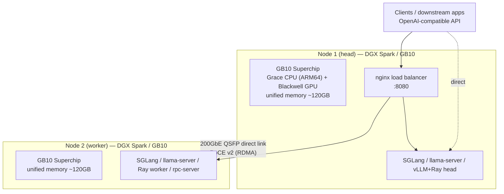
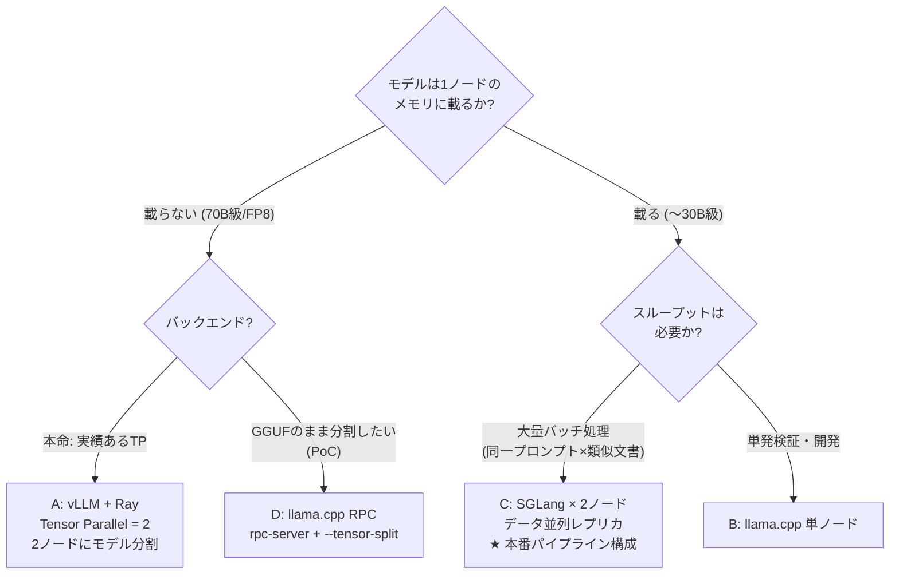
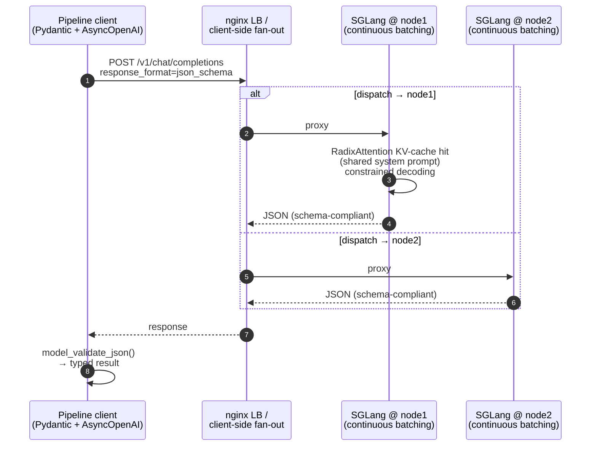

# Architecture / アーキテクチャ

All identifiers below (hostnames, IPs, ports, paths) are **placeholders**. This document describes the platform shape and the reasoning behind each design decision.
以下の識別子（ホスト名・IP・ポート・パス）はすべて**プレースホルダ**です。本書では基盤の構成と各設計判断の「なぜ」を説明します。

---

## 1. Physical topology / 物理構成

**Why this shape / なぜこの構成か**
- **統合メモリのGB10 × 2ノード:** 1ノード約120GBのユニファイドメモリで、Q4量子化なら30Bクラスが単ノードに余裕で載る。70Bクラスや非量子化モデルは2ノードに分割して対応し、「単ノードで足りるものは単ノード」を原則にした。
- **200GbE直結（スイッチレス）:** 2ノード構成ではスイッチを挟む理由がなく、QSFP DACケーブル直結が最も安価・低遅延。Tensor Parallel通信・RPC・モデル同期（rsync）を全てこのリンクに集約。
- **RoCE v2（RDMA）:** NCCLやllama.cpp RPCがRDMAを自動利用でき、TCP経由よりノード間テンソル転送のオーバーヘッドが小さい。
- **相互パスワードレスSSH:** クラスタ操作（リモート起動・同期・ヘルスチェック）をヘッドノードから片手で完結させる運用の土台。

---

## 2. Serving configuration selection / 推論構成の選択フロー

同一ハードウェア上で4つの構成を使い分ける。これが本基盤の中核的な設計判断。

**Why this shape / なぜこの構成か**
- **モデル分割は「最後の手段」:** Tensor Parallel / RPC分散はノード間通信がボトルネックになりやすい。載るモデルなら**分割せず各ノードに複製**（構成C）する方が、通信ゼロでスループットがほぼ2倍になる。
- **構成C（データ並列レプリカ）が本番パイプライン:** 実ワークロード（文書分類など）は10〜30BクラスのMoEモデルで足り、かつ大量バッチ処理でスループットが正義。推論サーバには最終的に**SGLang**を採用した — 同一のsystemプロンプト×類似形式の文書を大量に流すため、**RadixAttentionによるKVキャッシュの自動再利用**の効果が支配的だと実測で判断（→ [features/01-multi-backend-strategy.md](features/01-multi-backend-strategy.md)）。振り分けはnginxまたはパイプラインからのクライアント側ファンアウト。
- **llama.cpp（構成B）は開発・検証の入口:** 単一バイナリで依存が軽く、新モデルの検証や実験の立ち上げを最短で行える。実験はここから始めて本番はCへ移行する。
- **vLLM+Ray（構成A）は70B級専用:** Rayクラスタ＋NCCLをNIC固定で組む運用コストがあるため、単ノードに載らないモデルに限って使う。
- **llama.cpp RPC（構成D）はPoC扱い:** 公式もproof-of-conceptと位置づけており、本番はAかCに寄せる。GGUF資産をそのまま巨大モデルに使いたい場合の選択肢として検証・手順化のみ。

---

## 3. Request flow (main configuration C) / リクエストフロー（主用途構成）

**Why this shape / なぜこの構成か**
- **OpenAI互換APIで統一:** llama.cpp / vLLM / SGLang いずれのバックエンドでもクライアント側コードは同一。実験（llama.cpp）から本番（SGLang）への移行が接続先URLの変更だけで済んだ。
- **KVキャッシュ再利用を最大化するワークロード適合:** 本番バッチは同一のsystemプロンプト×類似形式の文書を大量に流すため、**RadixAttentionがプロンプト共通部分のKVキャッシュを自動再利用するSGLang**が最も効く。固定のsystemプロンプト（分類定義など数千トークン）を先頭に置くプロンプト設計もこの前提に合わせている。
- **制約デコードをサーバ側で強制:** `response_format=json_schema` により出力がスキーマ準拠であることをデコード時に保証（llama.cppはGBNF、SGLangは文法制約バックエンド）。下流のPydanticバインド失敗を実測で0%→100%準拠に改善した。
- **連続バッチング × 並列クライアント:** サーバの連続バッチングに対しクライアント側から並列リクエストを流し、プリフィルが飽和する並列度をベンチで特定してから本番並列数を決定。

---

## Cross-cutting concerns / 横断的関心事

- **Reproducibility / 再現性:** 起動・停止・モデル更新・障害時対応を全てrunbook（手順書）化。コマンドはコピペで再現可能な形で管理し、環境の属人化を排除。
- **Separation of concerns / 責務分離:** 推論サービングはネイティブバイナリ（llama.cpp）とコンテナ（SGLang / vLLM）が担い、Python venvは「モデルダウンロード（HF CLI）とAPI疎通確認」専用の最小構成。重い依存をホストに持ち込まない。
- **Benchmark-driven / 実測駆動:** スループット・スキーマ準拠率・並列度スイープを計測するベンチハーネスを整備し、構成変更は必ず実測で裏付けてから採用。
- **Security / セキュリティ:** クラスタは閉域ネットワーク内に閉じ、推論APIは外部非公開。認証情報（HF token等）は対話ログインまたは環境変数でのみ扱い、スクリプトへ平文で書かない。
