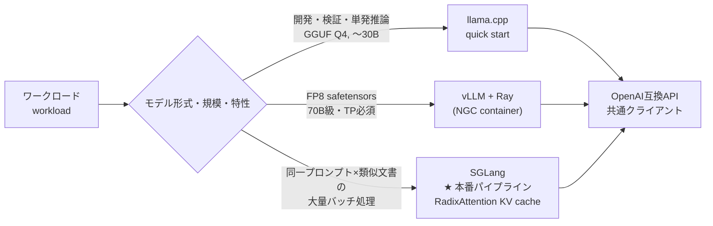

# 01. Multi-Backend Strategy / マルチバックエンド戦略

> One hardware platform, multiple serving engines: llama.cpp for quick starts and development, vLLM for scale, and SGLang adopted for the high-volume production pipeline — each chosen by measurement, not fashion.
> 同一ハードウェア上で、開発・検証は llama.cpp、大規模モデルは vLLM、そして大量データ処理の本番パイプラインには SGLang を採用。流行ではなく実測でエンジンを選定。

---

## 課題 / Problem

ローカルLLM推論のOSSエコシステムは選択肢が多く（llama.cpp / vLLM / SGLang / TGI …）、しかも進化が速い。加えて本環境はGB10（ARM64 + `sm_121`）という新しめのアーキテクチャで、「一般に速いと言われている構成」がそのまま動く保証も、速い保証もない。**エンジン選定を実機の測定で決める仕組み**が必要だった。

## 技術的な工夫 / Key engineering decisions

- **OpenAI互換APIを共通インターフェースに固定**
  llama.cpp（llama-server）・vLLM・SGLangはいずれもOpenAI互換エンドポイントを提供する。クライアント側を`AsyncOpenAI`＋Pydanticバインドで統一しておくことで、**バックエンドの差し替えが接続先URLの変更だけ**になり、同一ワークロードでの公平な比較と、将来の乗り換えが容易になった。

- **クイックスタートと開発・検証は llama.cpp（GGUF量子化）**
  Q4_K_M量子化で30Bクラスが1ノードに収まり、依存が軽く（単一バイナリ）、連続バッチング・プレフィックスキャッシュ・GBNF制約デコードが揃う。新モデルの検証・単発推論・実験の立ち上げはまずllama.cppで行い、最短で実測に入れるようにした。

- **vLLMは「単ノードに載らないモデル」担当**
  FP8のsafetensorsモデルや70B級はvLLM（NVIDIA NGCコンテナ）＋RayのTensor Parallelで2ノードに分割。コンテナ＋クラスタ管理の運用コストがかかるため、単ノードで足りる場合には使わない、という線引きを明確にした。

- **同一ワークロードでのベンチ比較を標準手順に**
  スループット（並列度スイープ）とスキーマ準拠率を測るベンチハーネスを整備し、llama.cpp / vLLM / SGLang を同じ文書分類ワークロードで比較。「エンジンを変えたら必ず同じベンチを流す」ことを構成変更の前提にした。

- **ワークロード特性の把握が選定より先**
  対象タスク（長いプロンプト×短い構造化出力）は**プリフィル律速**であると特定。この場合デコード速度の差より**KVキャッシュ（プレフィックスキャッシュ）の再利用効率**とプリフィル性能が効くため、比較の観点自体をワークロードに合わせて設計した。

- **大量データ処理の本番パイプラインには SGLang を採用**
  本番ワークロードは「同一のsystemプロンプト × 類似形式の文書」を数万件流すバッチ処理であり、**RadixAttentionによるKVキャッシュの自動再利用**が最も効く形。ベンチ比較の結果、この特性でのスループット優位を確認し、最終的にSGLangを本番バックエンドに採用した。構造化出力はJSON Schemaベースの制約デコードで担保し、クライアント側の要件（Pydanticバインド）は変えていない。

## 使い分けマップ / Selection map

## 効果 / Impact

- クライアントコードを変えずにバックエンドを差し替え・比較できる基盤が確立し、実験（llama.cpp）→本番（SGLang）の移行が接続先変更のみで完了
- 「どのエンジンをいつ使うか」が実測に基づく明文化されたルールになり、構成判断が属人化しない
- ワークロード特性（同一プロンプト×類似文書）とエンジン特性（RadixAttentionのKVキャッシュ再利用）を突き合わせて選定したことで、大量バッチの本番スループットを最大化
