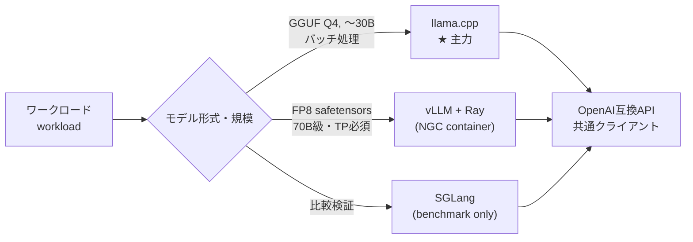

# 01. Multi-Backend Strategy / マルチバックエンド戦略

> One hardware platform, multiple serving engines: llama.cpp as the workhorse, vLLM for scale, SGLang for comparison — each chosen by measurement, not fashion.
> 同一ハードウェア上で llama.cpp を主力に、vLLM・SGLang を比較検証。流行ではなく実測でエンジンを選定。

---

## 課題 / Problem

ローカルLLM推論のOSSエコシステムは選択肢が多く（llama.cpp / vLLM / SGLang / TGI …）、しかも進化が速い。加えて本環境はGB10（ARM64 + `sm_121`）という新しめのアーキテクチャで、「一般に速いと言われている構成」がそのまま動く保証も、速い保証もない。**エンジン選定を実機の測定で決める仕組み**が必要だった。

## 技術的な工夫 / Key engineering decisions

- **OpenAI互換APIを共通インターフェースに固定**
  llama.cpp（llama-server）・vLLM・SGLangはいずれもOpenAI互換エンドポイントを提供する。クライアント側を`AsyncOpenAI`＋Pydanticバインドで統一しておくことで、**バックエンドの差し替えが接続先URLの変更だけ**になり、同一ワークロードでの公平な比較と、将来の乗り換えが容易になった。

- **主力は llama.cpp（GGUF量子化）**
  Q4_K_M量子化で30Bクラスが1ノードに収まり、依存が軽く（単一バイナリ）、連続バッチング・プレフィックスキャッシュ・GBNF制約デコードが揃う。バッチ分類・抽出という実ワークロードには十分な性能で、運用の単純さが決め手。

- **vLLMは「単ノードに載らないモデル」担当**
  FP8のsafetensorsモデルや70B級はvLLM（NVIDIA NGCコンテナ）＋RayのTensor Parallelで2ノードに分割。コンテナ＋クラスタ管理の運用コストがかかるため、llama.cppで足りる場合には使わない、という線引きを明確にした。

- **同一ワークロードでのベンチ比較を標準手順に**
  スループット（並列度スイープ）とスキーマ準拠率を測るベンチハーネスを整備し、llama.cpp / vLLM / SGLang を同じ文書分類ワークロードで比較。「エンジンを変えたら必ず同じベンチを流す」ことを構成変更の前提にした。

- **ワークロード特性の把握が選定より先**
  対象タスク（長いプロンプト×短い構造化出力）は**プリフィル律速**であると特定。この場合デコード速度の差よりプレフィックスキャッシュとプリフィル性能が効くため、比較の観点自体をワークロードに合わせて設計した。

## 使い分けマップ / Selection map

## 効果 / Impact

- クライアントコードを変えずにバックエンドを差し替え・比較できる基盤が確立
- 「どのエンジンをいつ使うか」が実測に基づく明文化されたルールになり、構成判断が属人化しない
- 軽量な主力（llama.cpp）に寄せたことで、日常運用はバイナリ起動＋nginxのみのシンプルな構成を維持
