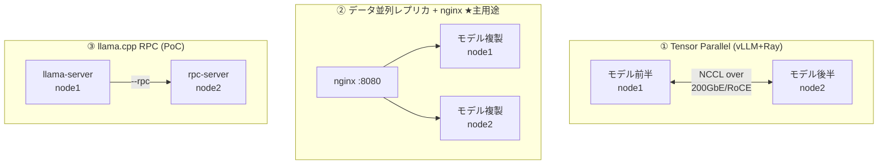

# 02. Distributed Inference / 分散推論

> Three ways to use two nodes: tensor parallelism, data-parallel replicas behind nginx, and llama.cpp RPC — and a decision framework for when to use which.
> 2ノードの使い方は3通り（Tensor Parallel / nginxデータ並列レプリカ / llama.cpp RPC）。それぞれの得失を検証し、選択基準をフレームワーク化。

---

## 課題 / Problem

「2台あるなら分散推論」と一括りにされがちだが、実際には**目的の異なる複数の分散方式**があり、選択を誤ると通信がボトルネックになってかえって遅くなる。単ノード約120GBの統合メモリという前提で、(a) 単ノードに載らないモデルを動かす、(b) 載るモデルのスループットを上げる、という2つの要求を整理して方式を割り当てる必要があった。

## 技術的な工夫 / Key engineering decisions

- **方式①: vLLM + Ray による Tensor Parallel（モデル分割）**
  70B級・FP8モデル向け。Node 1をRayヘッド、Node 2をワーカーとしてクラスタ化し、`tensor_parallel_size=2` でモデルの重みを2ノードに分割。NCCL/GLOOの通信インターフェースを**200GbEのNICに明示的に固定**し、意図しない経路（管理用LAN等）に通信が流れないようにした。

- **方式②: データ並列レプリカ + nginx（主用途）**
  単ノードに載るモデル（Q4の10〜30B級）は、**分割せず両ノードに同一モデルを複製**し、nginxのラウンドロビンで振り分ける。ノード間通信がゼロのためスループットはほぼ線形（約2倍）にスケールし、片ノード障害時も縮退運転できる。バッチ分類・抽出の本番はこの構成。

- **方式③: llama.cpp RPC（GGUFのまま分割）**
  `rpc-server` を建てたワーカーノードへ `--rpc` で接続し、`--tensor-split` で重みを分割配置する方式。GGUF資産をそのまま巨大モデルに流用できる一方、公式がproof-of-conceptと位置づけているため**PoC・検証用**と割り切り、手順の確立に留めた。RoCE検出時はRDMAが自動利用される。

- **選択フレームワークの明文化**
  「1ノードに載るか？」→「スループットが要るか？」の2つの質問で4構成（vLLM TP / llama.cpp単体 / レプリカ+LB / RPC）へ機械的に到達できる判断フローを整備（→ [../ARCHITECTURE.md](../ARCHITECTURE.md) §2）。**モデル分割は載らないときの最後の手段**、が原則。

- **実測でレプリカ構成の優位を確認**
  実ワークロード（プリフィル律速の文書分類）で並列度スイープを実施し、単ノードのプリフィル飽和点を特定した上で、2ノードレプリカ構成によりバッチ全体の処理時間をほぼ半減できることを確認した。

## 方式比較 / Strategy comparison

| 方式 | 対象 | ノード間通信 | スケール | 運用コスト |
| --- | --- | --- | --- | --- |
| ① vLLM+Ray TP | 単ノードに載らない70B級 | 多い（レイヤ間） | メモリが2倍に | 中（Ray+コンテナ） |
| ② レプリカ+nginx ★ | 載る10〜30B級のバッチ | なし | スループット約2倍 | 低（バイナリ+nginx） |
| ③ llama.cpp RPC | GGUFのまま分割したい場合 | 多い | メモリが2倍に | 低いがPoC品質 |

## 効果 / Impact

- 「分散＝分割」ではなく要求別に方式を使い分けることで、主用途では**通信オーバーヘッドゼロの約2倍スループット**を獲得
- 70B級が必要になった場合の手順（vLLM TP）とメモリ超過時の代替（RPC）も検証・文書化済みで、モデル規模の変化に即応できる
- 選択フローの明文化により、構成判断が再現可能になった
