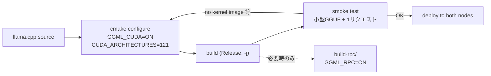

# 03. CUDA on ARM64 Build / ARM64 + CUDA ビルド

> Getting llama.cpp to run fast on GB10 (Grace Blackwell): CUDA 13 on aarch64, explicit `sm_121` architecture targeting, and the pitfalls of a brand-new compute capability.
> GB10（Grace Blackwell）で llama.cpp を正しく速く動かす: aarch64上のCUDA 13、`sm_121` の明示指定、新しすぎるcompute capabilityの罠。

---

## 課題 / Problem

GB10はGrace CPU（ARM64/aarch64）とBlackwell GPU（compute capability **12.1 = `sm_121`**）を統合メモリで結合した新しいアーキテクチャ。x86_64 + 既存GPU世代を前提にした配布バイナリや標準ビルド設定では、**そもそも動かない／カーネルが載らない**ことがある。OSSの推論スタックをこの環境で確実に動かすためのビルド要件を確立する必要があった。

## 技術的な工夫 / Key engineering decisions

- **`CMAKE_CUDA_ARCHITECTURES=121` の明示指定**
  llama.cppのCUDAビルドでアーキテクチャを明示しないと、生成されたバイナリが `sm_121` 向けカーネルを含まず、実行時に `no kernel image is available for execution on the device` で落ちる。GB10では**121の明示指定が必須**であることを特定し、ビルド手順に固定した。

  ```bash
  cmake -B build \
    -DGGML_CUDA=ON \
    -DCMAKE_BUILD_TYPE=Release \
    -DCMAKE_CUDA_ARCHITECTURES=121
  cmake --build build --config Release -j
  ```

- **aarch64 (sbsa-linux) 向けCUDA 13ツールチェーン**
  nvccは `sbsa-linux`（Server Base System Architecture）ターゲット。x86前提の手順やプリビルドwheelは使えないため、「ARM64ネイティブでビルドする」ことを原則にし、CUDA Toolkit 13系＋Release構成でcuBLAS等をリンクしたビルドを標準化した。

- **RPC用は別ビルドとして分離**
  RPC分散（`GGML_RPC=ON`）は通常ビルドと分け、`build/`（通常）と `build-rpc/`（RPC）を並置。日常運用のバイナリに検証用機能を混ぜず、どちらのビルドも独立に更新できるようにした。

- **重い推論系Python依存をホストに入れない**
  torch等のARM64対応はホイール供給が揺れやすい。推論本体はネイティブビルドのllama.cppとNVIDIA提供のvLLMコンテナ（NGC）に任せ、ホストのPython venvは `huggingface_hub` と `openai` のみの最小構成に留めることで、アーキテクチャ起因の依存地獄を回避した。

- **動作確認をスモークテストとして手順化**
  ビルド後は「小型GGUFをロード → `/v1/chat/completions` に1リクエスト → GPUオフロードをログで確認」という最小スモークテストを必ず実施。llama.cpp本体の更新（バージョン追随）時も同じ手順で退行を検知する。

## ビルド〜検証フロー / Build & verify flow



## 効果 / Impact

- GB10という新アーキテクチャ上で、llama.cpp（CUDAネイティブビルド）とSGLang / vLLM（コンテナ）の各スタックを安定稼働させる要件を確立
- 手順書化により、llama.cpp本体のバージョン追随（数週間ごと）を低リスクで実施できる
- ホスト環境を汚さない方針により、2ノード間の環境差分がほぼゼロに保たれ、レプリカ構成の前提が守られる
