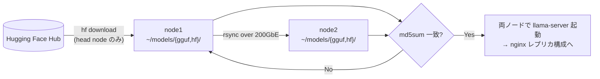

# 04. Model Ops / モデルオペレーション

> Managing tens-of-GB model assets across two nodes: quantization selection per use case, Hugging Face CLI acquisition, 200GbE rsync sync, and checksum verification.
> 数十GBのモデル資産を2ノードで運用する: 用途別の量子化選定、HF CLIでの取得、200GbE経由のrsync同期、チェックサム検証。

---

## 課題 / Problem

モデルファイルは1つ8〜34GBと大きく、バックエンドごとに形式も異なる（llama.cpp = GGUF、vLLM = safetensors）。さらにデータ並列レプリカ構成は「**両ノードに完全に同一のモデルがあること**」が前提のため、取得・配置・同期・検証を場当たり的にやると、ノード間の不整合や壊れたダウンロードが障害として跳ね返る。モデル資産の運用を標準化する必要があった。

## 技術的な工夫 / Key engineering decisions

- **量子化形式を用途別に選定**
  - **Q4_K_M（GGUF）**: 主力。品質劣化と圧縮率のバランスが良く、30BクラスのMoEが約17GBで単ノードに収まる
  - **FP8（safetensors）**: vLLM系での本番候補。品質を保ちつつTensor Coreの恩恵を受ける
  - **F16（GGUF）**: 小型のマルチモーダルモデル（OCR）など、量子化の影響が出やすい用途のみ
  「まずQ4_K_Mで実測し、品質が足りなければ上の精度へ」という順序で、メモリと品質のトレードオフを実測で決める。

- **MoEモデルの積極採用**
  プリフィル律速のバッチワークロードでは、総パラメータが大きくてもアクティブパラメータの小さいMoE（30B-A3B）がdense 32B比で大幅に高速なことをベンチで確認し、主力に採用。「モデルの大きさ」ではなく「実行コスト」で選ぶ。

- **取得はHF CLI、配置は形式別ディレクトリ**
  `hf download` でリポジトリ単位に取得し、`~/models/gguf/`（llama.cpp用）と `~/models/hf/`（vLLM用safetensors）へ形式別に配置。どのバックエンドがどこを見るかを固定し、起動スクリプトのパス指定を安定させる。

- **ノード間同期は200GbE経由のrsync + md5sum検証**
  モデルはヘッドノードで一度だけダウンロードし、直結の200GbEリンク経由でワーカーへrsync。転送後に両ノードで `md5sum` を突き合わせ、**同一性を検証してからレプリカ構成に投入**する。インターネット回線を2回使わず、数十GBの同期が高速に完了する。

- **認証情報は対話ログインのみ**
  Hugging Faceのトークンは `hf auth login` による対話設定とし、スクリプトや設定ファイルに平文で書かない。

## モデル配備フロー / Model deployment flow

## 効果 / Impact

- 「ダウンロード1回＋高速ローカル同期」により、モデル更新の所要時間と外部帯域を最小化
- チェックサム検証をゲートにしたことで、レプリカ間の不整合による「ノードによって応答品質が違う」型の障害を構造的に防止
- 用途別の量子化選定基準が明文化され、新モデル導入時の判断が迅速になった
