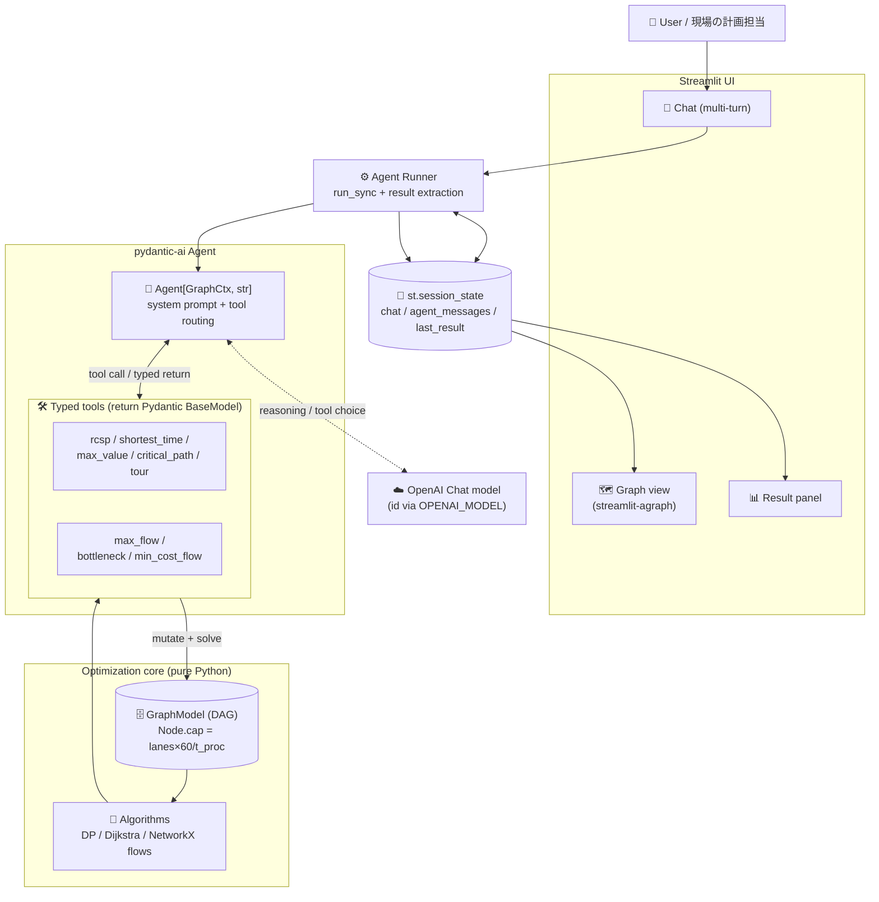
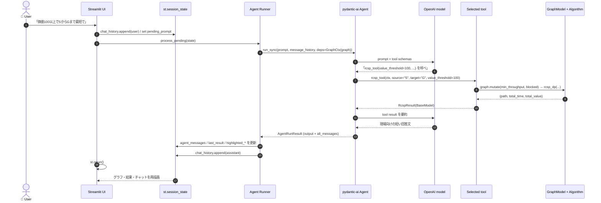
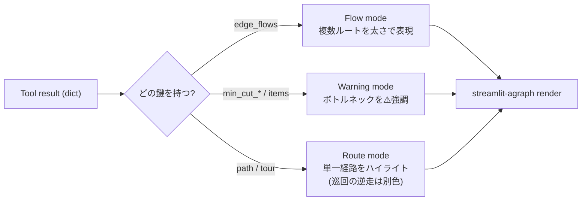

# Architecture / アーキテクチャ

All identifiers below (node names, model names, numbers) are **illustrative**. This document describes the system shape and the reasoning behind each design decision.
以下の識別子（ノード名・モデル名・数値）はすべて**例示**です。本書ではシステムの構成と各設計判断の「なぜ」を説明します。

---

## 1. System overview / システム全体図

**Why this shape / なぜこの構成か**
- **Thin UI, pure-Python core:** UI（Streamlit）と最適化ロジックを分離。アルゴリズムは `GraphModel` だけに依存する純粋関数群で、Streamlit や pydantic-ai を知らない。テストしやすく差し替えやすい。
- **Agent as a router, not a solver:** LLM には**計算をさせない**。数値解は必ず自作アルゴリズムが出し、LLM は「依頼の意図を汲んでツールを1つ選び、引数を埋める」役に徹する。数値の正しさを決定的（deterministic）に保つための境界設計。
- **Typed tool returns:** すべてのツールが Pydantic `BaseModel` を返すので、Runner と UI は文字列ではなく**構造**を受け取る。可視化モードの自動判定もこの型に依存。
- **Env-var LLM config:** モデルIDやAPIキーは環境変数のみで注入。コードにも `session_state` にも秘密情報を残さない。

---

## 2. One request, end to end / 1リクエストの流れ

**Why this shape / なぜこの構成か**
- **Enqueue → process → rerun:** ユーザー入力は即座に履歴へ積み（`pending_prompt`）、Agent 呼び出しは次の rerun で実行。入力の反映とスピナー表示を Streamlit の再実行モデルに素直に載せる。
- **`message_history` for multi-turn:** `run_sync` に前ターンまでの `agent_messages` を渡すことで、「じゃあ価値は無視して最短で」のような**文脈依存の追撃質問**を継続できる。
- **Deterministic numbers, natural-language wrap:** ツールが返した型付き結果を LLM に**要約だけ**させる。数値は常にアルゴリズム由来で、文章は現場の言葉に整える二段構え。

---

## 3. Tool result → visualization dispatch / 結果の形で描画モードを切替

**Why this shape / なぜこの構成か**
- **Shape-driven rendering:** ツールごとに描画関数を分岐させず、**戻り値の構造**（`edge_flows` / `min_cut` / `path`）で描画モードを1箇所で判定。ツールを増やしても UI 側の分岐が線形に増えない。
- **Three modes, one canvas:** 単一経路・複数ルートのフロー・ボトルネック警告を同じ agraph キャンバス上で描き分け、色・太さ・破線・アイコンで意味を伝える（例: 巡回モードの逆走は別色の追加エッジで表現）。

---

## Cross-cutting concerns / 横断的関心事

- **Type safety / 型安全:** ツールの入出力はすべて Pydantic `BaseModel`。OpenAI Tools API が tuple/prefixItems を扱えない制約に対し、`BlockedEdge` などの**引数モデル**を挟んで回避しつつ、境界で必ずバリデーションする。
- **Tool selection / ツール選択の仕組み:** system prompt にデータモデルと「この言い回しならこのツール」の対応方針を記述し、LLM が**1リクエスト＝1ツール**を選ぶよう誘導。情報不足時は追加質問を返す設計。
- **Cross-cutting capacity / 横断的な容量制約:** 派生 `cap` を用いた `min_throughput` と `blocked_nodes/edges` を、単一経路系ツール共通のフックとして `GraphModel.mutate()` に集約。**元グラフを壊さず**派生グラフを作って解く。
- **Visualization / 可視化:** `streamlit-agraph` に階層レイアウトを指定し、ノード属性はツールチップ、経路は色・太さ、フローは太さ、ボトルネックは警告色で表現。描画モードは結果の形から自動判定。
- **Determinism / 決定性:** 数値計算は LLM ではなく自作アルゴリズムが担当。同じグラフ・同じ依頼なら同じ解が出る（TSP の焼きなましは乱数シード固定で再現性を確保）。
