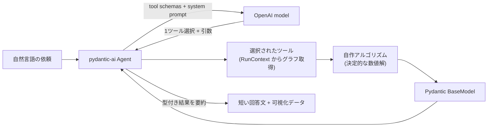

# 01. LLM Tool Routing / LLMによるツール自動選択

> One natural-language request → the agent picks exactly one of nine optimization tools, fills its arguments, runs a deterministic algorithm, and wraps the typed result in a short answer.
> 1つの自然言語依頼から、エージェントが9つの最適化ツールのうち適切な1つを選び、引数を埋め、決定的なアルゴリズムを実行し、型付き結果を短い回答に整える。

関連スニペット: [agent_and_tools.py](../snippets/agent_and_tools.py)

---

## 課題 / Problem

「最短で作りたい」「価値を最大化したい」「どこが詰まっている？」——利用者の問いは自然言語で、しかも**それぞれ必要な最適化手法が違う**。利用者に「これはRCSPです、あれは最大流です」と手法を選ばせるのは非現実的。一方で、LLM に数値計算そのものをさせると誤りが混入し、答えの正しさを保証できない。**「意図の解釈は LLM、計算はアルゴリズム」**という役割分担を、型安全に実装する必要があった。

## 技術的な工夫 / Key engineering decisions

- **Agent はルーター、ソルバではない**
  pydantic-ai の `Agent[GraphCtx, str]` に9つのツールを登録し、system prompt に「この言い回しならこのツール」の対応方針とデータモデル（`t_proc` / `v` / `lanes` / 派生 `cap`）を明記。LLM は**1リクエストにつき1ツール**を選び、引数を埋めるだけ。数値はツール内の自作アルゴリズムが決定的に出す。

- **`RunContext` による型付き依存注入（DI）**
  グラフ本体は `deps_type=GraphCtx` として Agent に渡し、各ツールは `ctx.deps.store` から取得する（[agent_and_tools.py](../snippets/agent_and_tools.py) 参照）。ツールシグネチャにグラフを引数として並べないので、LLM が埋めるのは「依頼から読み取るべき値（source / target / value_threshold など）」だけになり、選択精度が上がる。

- **戻り値はすべて Pydantic `BaseModel`**
  `RcspResult` / `MaxFlowResult` / `MinCostFlowResult` など、ツールごとに型付き結果を定義。Runner と UI は文字列を parse せず**構造**を受け取れる。

- **引数モデルで Tools API の制約を回避**
  OpenAI Tools API は tuple / `prefixItems` をスキーマ化できない。そこで `(src, dst)` のような組は `BlockedEdge(BaseModel)` のような**引数モデル**で受け、内部で tuple に変換する。型安全と API 互換を両立。

- **モデルはキャッシュ、接続は環境変数**
  モデルIDごとに Agent インスタンスを生成・キャッシュ（`get_agent(model_name)`）。APIキーとモデルIDは環境変数からのみ注入し、コードに秘密を置かない。

## フロー / Flow

## 効果 / Impact

- 利用者は手法名を知らなくても、自然言語で最適化を実行できる
- 数値は常にアルゴリズム由来（LLM に計算させない）で、答えの正しさを決定的に担保
- 型付き戻り値により、UI 側は結果の「形」だけで可視化を分岐でき、ツール追加に強い
- 引数モデルの導入で、tuple を含む複雑な引数も Tools API 上で安全に受け渡し
