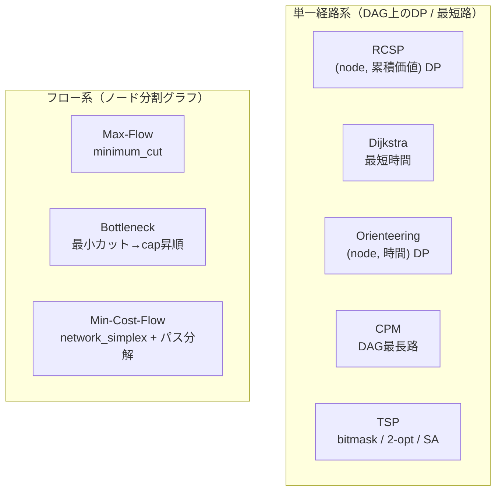

# 02. OR Algorithms / 数理最適化アルゴリズムの自前実装

> Around eight classic operations-research algorithms implemented from scratch on one graph model — including a resource-constrained shortest path, a size-adaptive TSP solver, and node-split max-flow / min-cost-flow.
> 1つのグラフモデルの上に、古典的なORアルゴリズムを約8種類すべて自前実装。価値制約付き最短経路、規模適応のTSPソルバ、ノード分割による最大流・最小費用流などを含む。

関連スニペット: [rcsp.py](../snippets/rcsp.py) / [tsp.py](../snippets/tsp.py) / [graph_model.py](../snippets/graph_model.py)

---

## 課題 / Problem

工程計画の問いは、見た目こそ似ていても要求される最適化が根本的に異なる。「価値の下限を満たしつつ最短」は**資源制約付き最短経路（RCSP）**、「時間予算内で価値最大」は**オリエンテーリング**、「全工程の下限時間」は**DAG最長路（CPM）**、「1回ずつ巡回」は**TSP**、「何個流せる／どこが詰まる／最小費用で流す」は**フロー系**。これらを1つの `GraphModel` 上で、正しく・決定的に解く実装が必要だった。

## 技術的な工夫 / Key engineering decisions

- **状態(state)ベースの動的計画法（DP）— RCSP / Orienteering**
  RCSP は `(node, 累積価値)` を状態に、各状態の最小到達時間を DAG のトポロジカル順で更新。閾値 `Σv ≥ value_threshold` を満たす終端状態のうち最小時間のものから、親ポインタを辿って経路を復元する（[rcsp.py](../snippets/rcsp.py) 参照）。Orienteering は状態を `(node, 時間バケット)` に取り替えるだけで**時間予算内の価値最大**を解く、双対的な設計。

- **規模で解法を自動選択する TSP ソルバ**
  巡回は入力サイズで厳密性と速度が両立しない。そこで `n ≤ 12` は**ビットマスクDPで厳密解**、`n ≤ 100` は**最近傍＋2-opt**、それ以上は**焼きなまし法（SA）**へ自動フォールバックする（[tsp.py](../snippets/tsp.py) 参照）。視察モードでは DAG の向きを緩和し、`t_move` の全点対最短路を距離行列として使う。SA は乱数シードを固定し再現性を確保。

- **ノード分割による最大流 / 最小費用流**
  「工場そのものの処理能力（`cap`）」がボトルネックになり得るため、各ノード `v` を `v_in → v_out` に**分割**し、その内部辺に `cap` を載せる。これで辺容量だけでなく**ノード容量**も最小カットに現れる。最大流は `minimum_cut`、最小費用流は超入口・超出口を付けた `network_simplex` で解き、結果の辺フローを**パス単位に分解**して「ルートごとの生産個数と価値」を提示する。

- **DAG最長路（CPM）と最短時間（Dijkstra）**
  完成時間の下限は `dag_longest_path`、価値を無視した最短時間は Dijkstra。辺重み `weight = t_move + 宛先の t_proc` とすることで、始点の処理時間を出力辺に畳み込み、素の最短路/最長路がそのまま総所要時間になるようモデル化。

- **派生スループット `cap` の一元計算**
  `cap = lanes × 60 / t_proc` は `Node.cap` プロパティで一箇所に集約（[graph_model.py](../snippets/graph_model.py) 参照）。倉庫など `t_proc=0` のノードは容量無制限として扱う。

## 解法の対応 / Algorithm map

## 効果 / Impact

- 多様な計画の問いを、1つのグラフモデルの上で決定的に解ける
- TSP の規模別自動選択により、小規模は厳密・大規模は現実的な時間で近似
- ノード分割で「工場自体の処理能力」までボトルネック解析に反映
- 最小費用流のパス分解により、「どのルートに何個流すか」を現場が読める形で提示
