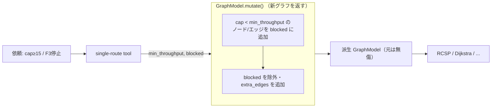

# 03. Cross-Cutting Constraints / 横断的な制約適用

> A single `min_throughput` hook (plus blocked nodes/edges) applies capacity constraints uniformly across every single-route tool — by deriving a new graph, never mutating the original.
> `min_throughput`（と blocked ノード/エッジ）という単一のフックが、容量制約をすべての単一経路系ツールに一様に適用する。しかも元グラフは壊さず、派生グラフを作って解く。

関連スニペット: [graph_model.py](../snippets/graph_model.py) / [agent_and_tools.py](../snippets/agent_and_tools.py)

---

## 課題 / Problem

「1時間に15個以上流せる経路で、価値100以上を満たし最短で」——このような**スループット条件**は、RCSP でも最短時間でも巡回でも、どのツールでも同じ意味で効いてほしい。もし各アルゴリズムの中に容量判定を書き込むと、ツールごとに実装が重複し、条件が食い違うリスクが生まれる。また「工場F3が停止中」のような**遮断**も、複数ツールで共通に扱いたい。横断的な制約を**1箇所**に集約する仕組みが必要だった。

## 技術的な工夫 / Key engineering decisions

- **`min_throughput` を派生 `cap` で解釈する共通フック**
  各ノード/エッジの `cap`（ノードは `lanes × 60 / t_proc` の派生値）と `min_throughput` を比較し、**`cap < min_throughput` の要素を自動的に blocked 化**する。容量無制限（`cap=None`、倉庫など）は常に通過。これにより「cap がX以上の所だけ通る」条件が、アルゴリズム本体に手を入れずに全ツールへ効く。

- **不変な値オブジェクトとしての `GraphModel.mutate()`**
  `mutate(blocked_nodes, blocked_edges, extra_edges, min_throughput)` は、指定の摂動を適用した**新しい `GraphModel` を返す**（元は破壊しない、[graph_model.py](../snippets/graph_model.py) 参照）。ツールは `ctx.deps.store.mutate(...)` で派生グラフを得てからアルゴリズムに渡すので、`session_state` に保持した基準グラフは常に無傷。マルチターンで条件を変えても副作用が残らない。

- **ツール側は「摂動を渡すだけ」**
  単一経路系ツール（RCSP / 最短時間 / 最大価値 / 巡回）は、`min_throughput` / `blocked_nodes` / `blocked_edges` をそのまま `mutate()` に受け渡すだけ（[agent_and_tools.py](../snippets/agent_and_tools.py) 参照）。制約ロジックは `mutate()` に一元化され、ツールは薄い。

- **引数モデルで安全に受ける**
  遮断エッジや追加エッジは `BlockedEdge` / `ExtraEdge` の Pydantic モデルで受け取り、内部で tuple へ変換。LLM が埋める引数も型で守られる。

## 適用フロー / How it applies

## 効果 / Impact

- 容量・遮断の制約を1箇所（`mutate()`）に集約し、全ツールで一貫適用
- 不変な派生グラフにより、基準グラフを壊さずマルチターンで条件を切り替え可能
- アルゴリズム本体は制約を意識せず、各ツールは「摂動を渡すだけ」の薄い実装に保てる
- 新しい制約を足すときも、追加はほぼ `mutate()` 内に閉じる
