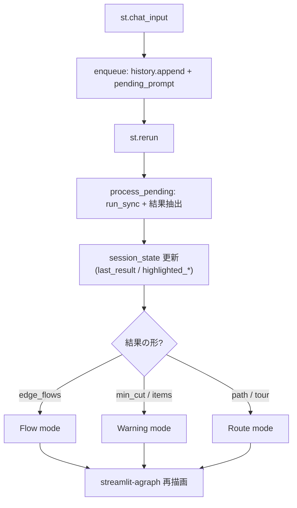

# 04. Conversational UI / 対話UIと可視化

> A Streamlit single-page app: multi-turn chat kept in `session_state`, and an agraph view that auto-switches between single-route, multi-route flow, and bottleneck-warning rendering based on the tool result.
> Streamlit のシングルページUI。マルチターンの会話を `session_state` に保持し、agraph ビューがツール結果に応じて「単一経路 / 複数ルートのフロー / ボトルネック警告」の描画モードを自動で切り替える。

関連スニペット: [streamlit_agent_hook.py](../snippets/streamlit_agent_hook.py)

---

## 課題 / Problem

最適化の答えは数字の羅列だけでは現場に伝わらない。「どの経路か」「どこが詰まるか」「どのルートに何個流すか」を**グラフ上で直感的に**見せたい。また「じゃあ価値は無視して最短で」のような追撃質問を継続できる**マルチターン**が要る。さらに、ツールごとに UI を作り込むと、ツールを増やすたびに描画コードが分岐で膨らむ。**結果の形に反応する薄いUI**が必要だった。

## 技術的な工夫 / Key engineering decisions

- **`session_state` に会話とグラフ状態を集約**
  基準グラフ、UI表示用の `chat_history`、pydantic-ai に渡す `agent_messages`、直近のツール結果 `last_result`、ハイライト対象（`highlighted_path` / `highlighted_nodes` / `edge_flows` など）を1つの `AppState` にまとめて保持（[streamlit_agent_hook.py](../snippets/streamlit_agent_hook.py) 参照）。`reset_conversation()` で一括初期化。

- **enqueue → process → rerun の一巡**
  入力は即座に履歴へ積んで `pending_prompt` を立て、Agent 呼び出しは次の rerun でスピナー付きに実行。Streamlit の再実行モデルに逆らわず、入力反映と「考え中…」表示を自然に両立。

- **`message_history` でマルチターン継続**
  `run_sync(prompt, message_history=agent_messages, deps=...)` に前ターンまでの履歴を渡し、文脈依存の追撃質問に対応。結果の `all_messages()` を次ターンへ引き継ぐ。

- **結果の「形」で描画モードを自動判定**
  ツール結果が `edge_flows` を持てば**フローモード**（複数ルートを太さで表現）、`min_cut_*` / `items` を持てば**警告モード**（ボトルネックを⚠️で強調）、`path` / `tour` を持てば**経路モード**（単一経路をハイライト）。1箇所の判定で3モードを同じ agraph キャンバスに描き分ける。

- **agraph の表現設計**
  ノード属性（`t_proc` / `lanes` / `cap` / `v`）はツールチップ、工場と倉庫はアイコンと形状で区別、経路は色と太さ、フローは太さの濃淡、ボトルネックは警告色。巡回モードの逆走・中継は別色の追加エッジで表現。階層レイアウトで DAG の流れを左→右に固定。

## 描画モードの分岐 / Rendering dispatch

## 効果 / Impact

- 最適化結果をグラフ上でハイライトし、経路・詰まり・フロー配分を直感的に把握
- `session_state` × `message_history` で文脈を継続する自然な対話が可能
- 結果の形に反応する1箇所の判定で、ツールを増やしても描画分岐が膨らまない
- enqueue→process→rerun により、入力反映と処理中表示を Streamlit 流に両立
