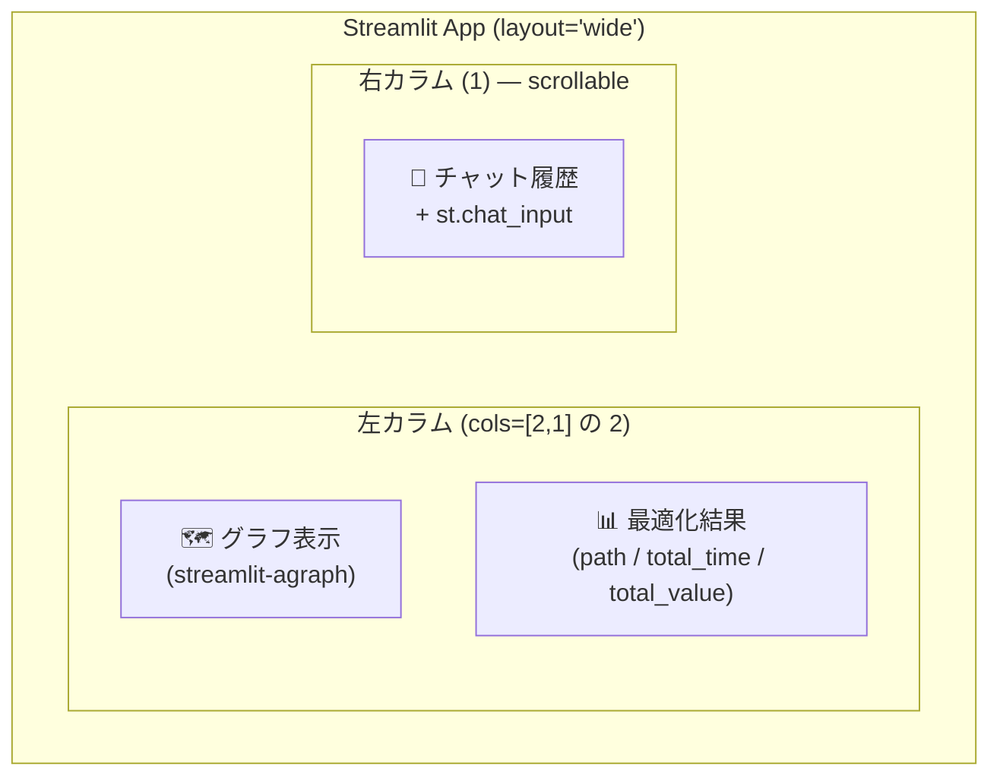
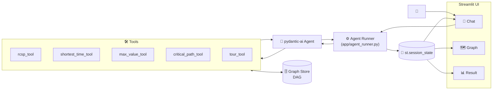
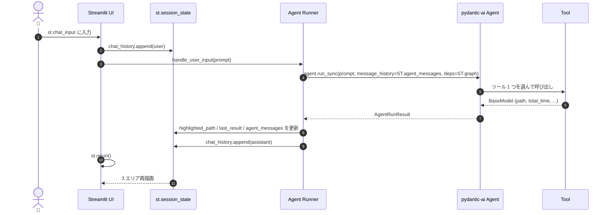

# 全体アーキテクチャ — Streamlit UI 含む

`demo_manufacturing.md` のシナリオを Streamlit アプリとして組み立てる際の設計。

<!-- @import "[TOC]" {cmd="toc" depthFrom=1 depthTo=6 orderedList=false} -->

---

## 1. UI レイアウト



```python
# app/main.py（レイアウト骨子）
st.set_page_config(layout="wide")
left, right = st.columns([2, 1])

with left:
    with st.container(height=460, border=True):
        render_graph(state.graph, state.highlighted_path)
    with st.container(height=240, border=True):
        render_result(state.last_result)

with right:
    with st.container(height=720, border=True):
        for msg in state.chat_history:
            with st.chat_message(msg.role):
                st.markdown(msg.content)
    if prompt := st.chat_input("質問を入力..."):
        handle_user_input(prompt)
        st.rerun()
```

---

## 2. 全体アーキテクチャ



---

## 3. `st.session_state` スキーマ

| キー | 型 | 役割 |
|---|---|---|
| `graph` | `GraphModel` | DAG 本体（ノード属性 `t_proc, v` 含む） |
| `chat_history` | `list[ChatMessage]` | UI 描画用の `role` + `content` 履歴 |
| `agent_messages` | `list[ModelMessage]` | pydantic-ai に渡す会話履歴（マルチターン継続用） |
| `last_result` | `OptimizationResult \| None` | 最後のツール戻り値（dict 化済み） |
| `highlighted_path` | `list[str]` | グラフ上で色付け・太字化するノード列 |

---

## 4. データフロー（1 ターン）



---

## 5. グラフ描画（streamlit-agraph）

```python
# app/graph_view.py
from streamlit_agraph import agraph, Node, Edge, Config

HL = "#ff6b6b"     # ハイライト色
BASE = "#9aa5b1"   # 通常色


def render_graph(graph, highlighted_path: list[str]) -> None:
    hl_nodes = set(highlighted_path)
    hl_edges = set(zip(highlighted_path, highlighted_path[1:]))

    nodes = [
        Node(
            id=n.id,
            label=n.id,
            title=f"t_proc={n.t_proc} / v={n.v}",   # ホバーで属性表示
            color=HL if n.id in hl_nodes else BASE,
            size=28 if n.id in hl_nodes else 18,
        )
        for n in graph.nodes
    ]
    edges = [
        Edge(
            source=e.src,
            target=e.dst,
            label=f"t={e.t_move}",
            color=HL if (e.src, e.dst) in hl_edges else BASE,
            width=4 if (e.src, e.dst) in hl_edges else 1,
        )
        for e in graph.edges
    ]
    config = Config(width=700, height=440, directed=True, hierarchical=True)
    agraph(nodes=nodes, edges=edges, config=config)
```

---

## 6. 実装サンプル（app/ スケルトン）

### 6-1. `app/state.py`

```python
from dataclasses import dataclass, field
from typing import Any, Literal

import streamlit as st

from app.graph_model import GraphModel, load_graph


@dataclass
class ChatMessage:
    role: Literal["user", "assistant"]
    content: str


@dataclass
class AppState:
    graph: GraphModel
    chat_history: list[ChatMessage] = field(default_factory=list)
    agent_messages: list[Any] = field(default_factory=list)   # pydantic-ai ModelMessage
    last_result: dict | None = None
    highlighted_path: list[str] = field(default_factory=list)


def get_state() -> AppState:
    if "app_state" not in st.session_state:
        st.session_state.app_state = AppState(graph=load_graph("data/process_dag.json"))
    return st.session_state.app_state
```

### 6-2. `app/agent_runner.py`

```python
from pydantic_ai import Agent
from app.state import AppState, ChatMessage
from app.agent_def import agent, GraphCtx   # demo_manufacturing.md §5 のもの


_RESULT_PATH_KEY = ("path", "tour")   # path / tour どちらかが含まれていれば抽出


def handle_user_input(state: AppState, prompt: str) -> None:
    state.chat_history.append(ChatMessage("user", prompt))

    result = agent.run_sync(
        prompt,
        message_history=state.agent_messages,
        deps=GraphCtx(store=state.graph),
    )

    state.agent_messages = result.all_messages()
    state.chat_history.append(ChatMessage("assistant", result.output))

    # ツール戻り値から path / tour を取り出してハイライト更新
    for call in result.tool_calls():
        out = call.output.model_dump() if hasattr(call.output, "model_dump") else {}
        for k in _RESULT_PATH_KEY:
            if k in out:
                state.highlighted_path = out[k]
                state.last_result = out
                break
```

### 6-3. `app/main.py`

```python
import streamlit as st

from app.state import get_state
from app.graph_view import render_graph
from app.agent_runner import handle_user_input


def render_result(result: dict | None) -> None:
    if result is None:
        st.caption("まだ最適化は実行されていません。")
        return
    cols = st.columns(3)
    cols[0].metric("総時間", result.get("total_time", "-"))
    cols[1].metric("総価値", result.get("total_value", "-"))
    cols[2].metric("経路長", len(result.get("path") or result.get("tour") or []))
    st.write("**経路:** " + " → ".join(result.get("path") or result.get("tour") or []))


st.set_page_config(layout="wide", page_title="製造工程 最適化エージェント")
state = get_state()

left, right = st.columns([2, 1])

with left:
    with st.container(height=460, border=True):
        render_graph(state.graph, state.highlighted_path)
    with st.container(height=240, border=True):
        render_result(state.last_result)

with right:
    with st.container(height=720, border=True):
        for msg in state.chat_history:
            with st.chat_message(msg.role):
                st.markdown(msg.content)
    if prompt := st.chat_input("質問を入力..."):
        handle_user_input(state, prompt)
        st.rerun()
```

### 6-4. ファイル構成（参考）

```
app/
├── main.py            # レイアウト + チャットループ
├── state.py           # session_state スキーマ
├── graph_view.py      # streamlit-agraph 描画
├── agent_runner.py    # pydantic-ai 呼び出しと state 反映
├── agent_def.py       # demo_manufacturing.md §5 のツール定義
└── graph_model.py     # GraphModel / GraphStore 実装
data/
└── process_dag.json   # DAG 定義
```

---

## 7. 動作確認手順

1. `pip install streamlit streamlit-agraph pydantic-ai`
2. `streamlit run app/main.py` → 左カラム上下と右カラムが配置される
3. 右側に「価値 V ≥ 100 を満たして最短で完成させたい」と入力
   - 左上: `S → ... → G` の経路がハイライト
   - 左下: `total_time / total_value / 経路` が表示
   - ノードホバーで `t_proc / v` のツールチップ
4. 続けて「価値は気にしない、最短で」と入力
   - `agent_messages` が引き継がれ、別ツール（Dijkstra）で再計算
   - ハイライトと結果が新しい解に切り替わる
