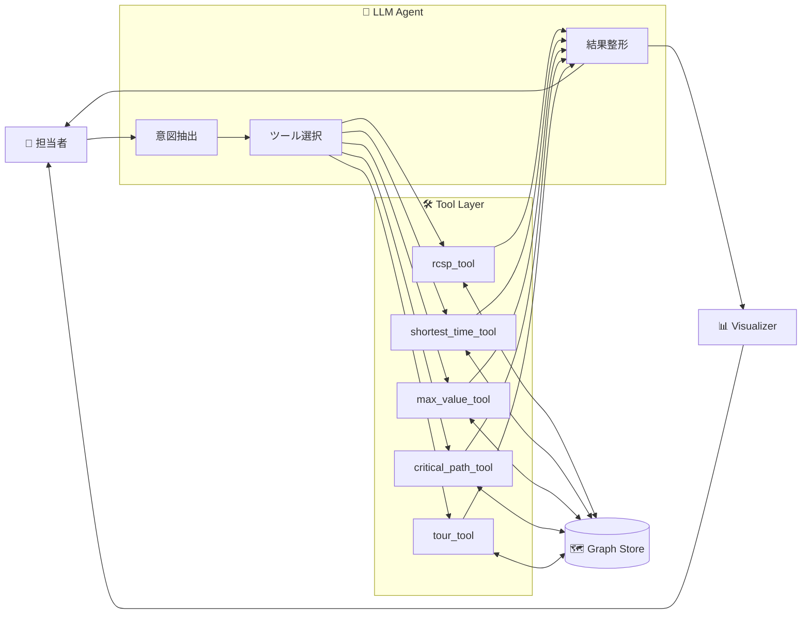
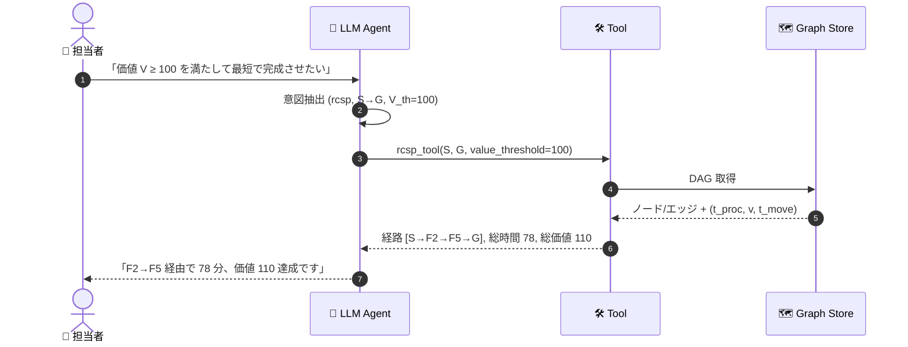
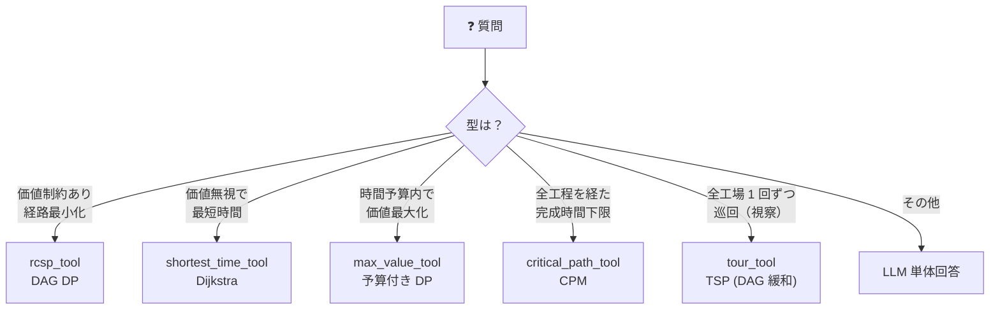
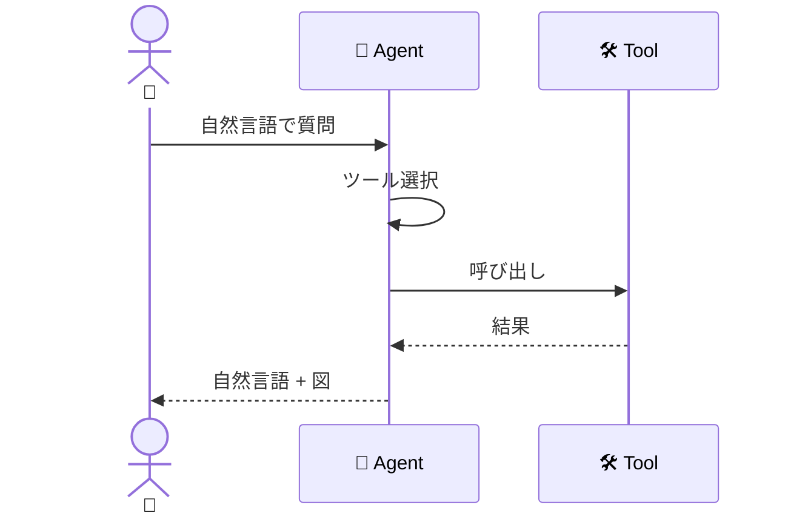
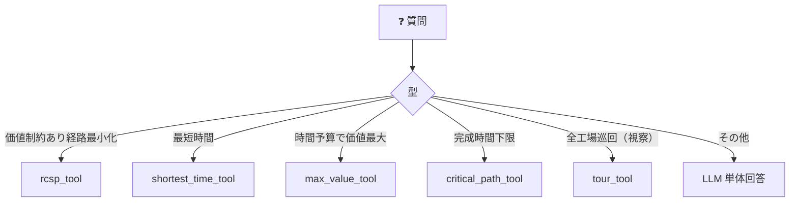

# デモシナリオ詳細 — 製造工程シミュレーション

`scenario.md` の概要を「製造工程シミュレーション」題材で具体化したもの。

<!-- @import "[TOC]" {cmd="toc" depthFrom=1 depthTo=6 orderedList=false} -->

---

## 1. シナリオ背景

- **ノード**
  - 始点 `S`: 原料（価値 = 0、`cap = ∞`、`t_proc = 0`）
  - 中間 `F1, F2, ...`: 加工工場
    - `t_proc` : 1 個あたりの処理時間（**分/個**）
    - `v` : 1 個あたりの付与価値
    - `lanes` : 並列ライン数（同時に処理できる個数）
    - **`cap = lanes × 60 / t_proc`（個/h）** ← 派生値
  - 終点 `G`: 完成品（`cap = ∞`）
- **エッジ**: 配送路。`t_move`（**分**）、`cap`（**個/h**、搬送容量）。**DAG（閉路なし）** 前提。
- **制約**: 経路上の `Σ v ≥ V_th`（閾値超過 OK）／必要に応じ単位時間あたりの流量も評価
- **目的**: `Σ (t_move + t_proc)` 最小（基本）/ 時間予算内 `Σ v` 最大（双対）/
  単位時間流量の最大化・最小コスト流量計画 など
- **エージェント**: 意図解釈 → ツール選択 → 結果を自然言語＋図で返す

---

## 2. Mermaid 図 ① — 全体図

### 2-1. システム構成



### 2-2. 会話シーケンス



### 2-3. アルゴリズム選択 決定木



---

## 3. Mermaid 図 ② — 簡易版

### 3-1. 会話シーケンス（簡易）



### 3-2. アルゴリズム選択（簡易）



---

## 4. 質問例とアルゴリズム対応表

| # | 質問例 | ツール | 内部アルゴリズム |
|---|---|---|---|
| 1 | 「価値 V ≥ 100 を満たして最短で完成させたい」 | `rcsp_tool` | DAG 上の `(node, value_bucket)` DP |
| 2 | 「価値は気にしない、とにかく最短で完成までの経路は？」 | `shortest_time_tool` | Dijkstra |
| 3 | 「90 分以内で集められる価値の上限は？」 | `max_value_tool` | 予算付き DP (Orienteering on DAG) |
| 4 | 「全工程を経た場合の完成時間下限を知りたい」 | `critical_path_tool` | CPM (DAG 最長パス) |
| 5 | 「工場 F3 が停止中。閾値 V 維持で最短経路は？」 | `rcsp_tool` | DP + `blocked_nodes=[F3]` |
| 6 | 「臨時で配送路 F2→F5 を追加できる。最短経路は？」 | `rcsp_tool` | DP + `extra_edges=[(F2,F5,t)]` |
| 7 | 「視察で F1..F8 を 1 回ずつ回りたい、最短は？」 | `tour_tool` | TSP (NN + 2-opt, DAG 緩和) |
| 8 | 「ピーク時に S から G に 1 時間で何個流せる？」 | `max_flow_tool` | Dinic / 最小カット（ノード分割） |
| 9 | 「どこがボトルネック？増強優先度は？」 | `bottleneck_tool` | 最小カットから cap 昇順で列挙 |
| 10| 「30 個/h を最小コストで流したい」 | `min_cost_flow_tool` | NetworkX network_simplex（ノード分割） |
| 11| 「1 時間に 15 個以上流せる経路で、価値 100 以上を最短で」 | `rcsp_tool` | RCSP + `min_throughput=15` で cap 不足要素を自動除外 |

各行は §2-3 の決定木の葉と 1 対 1 対応。
工場・配送路の追加削減は `blocked_nodes` / `blocked_edges` / `extra_edges` で全ツール共通に扱う。
throughput 条件（「1 時間に X 個以上」）は全単一経路ツールが受ける共通引数 `min_throughput` で扱う。

---

## 5. 実装サンプル（pydantic-ai）

### 5-1. Agent 定義

```python
from dataclasses import dataclass
from typing import Literal

from pydantic import BaseModel
from pydantic_ai import Agent, RunContext


@dataclass
class GraphCtx:
    store: "GraphStore"   # DAG: ノード属性 (t_proc, v) / エッジ属性 (t_move)


agent = Agent[GraphCtx, str](
    model="openai:gpt-4o",
    deps_type=GraphCtx,
    system_prompt=(
        "製造工程の計画担当者を支援するエージェント。"
        "グラフは DAG。ノードは加工工場で処理時間 t_proc と付与価値 v、"
        "エッジは配送路で移動時間 t_move を持つ。"
        "依頼を読み取り、登録ツールから最適な 1 つを選んで呼び出す。"
        "情報が足りなければ追加質問する。結果は短く現場の言葉で返す。"
    ),
)


Edge = tuple[str, str, float]   # (from, to, t_move)
```

### 5-2. rcsp_tool — 価値制約付き最短経路

```python
class RcspResult(BaseModel):
    path: list[str]
    total_time: float
    total_value: float


@agent.tool
def rcsp_tool(
    ctx: RunContext[GraphCtx],
    source: str,
    target: str,
    value_threshold: float,
    blocked_nodes: list[str] | None = None,
    blocked_edges: list[tuple[str, str]] | None = None,
    extra_edges: list[Edge] | None = None,
) -> RcspResult:
    """DAG 上で Σv ≥ value_threshold を満たす最小総時間の経路。

    状態 (node, value_bucket) の DP。価値は離散化バケットで近似。
    """
    g = ctx.deps.store.mutate(
        blocked_nodes=blocked_nodes or [],
        blocked_edges=blocked_edges or [],
        extra_edges=extra_edges or [],
    )
    path, t, v = g.rcsp_dp(source, target, value_threshold)
    return RcspResult(path=path, total_time=t, total_value=v)
```

### 5-3. shortest_time_tool — 単純最短時間（Dijkstra）

```python
class PathResult(BaseModel):
    path: list[str]
    total_time: float


@agent.tool
def shortest_time_tool(
    ctx: RunContext[GraphCtx],
    source: str,
    target: str,
    blocked_nodes: list[str] | None = None,
    blocked_edges: list[tuple[str, str]] | None = None,
) -> PathResult:
    """価値制約を無視した最短時間経路 (Dijkstra)。"""
    g = ctx.deps.store.mutate(
        blocked_nodes=blocked_nodes or [], blocked_edges=blocked_edges or []
    )
    path, t = g.dijkstra(source, target, weight="t_total")
    return PathResult(path=path, total_time=t)
```

### 5-4. max_value_tool — 時間予算で価値最大化（Orienteering）

```python
class ValueResult(BaseModel):
    path: list[str]
    total_value: float
    total_time: float


@agent.tool
def max_value_tool(
    ctx: RunContext[GraphCtx],
    source: str,
    target: str,
    time_budget: float,
    blocked_nodes: list[str] | None = None,
    blocked_edges: list[tuple[str, str]] | None = None,
) -> ValueResult:
    """DAG 上で総時間 ≤ time_budget を満たす最大価値経路 (予算付き DP)。"""
    g = ctx.deps.store.mutate(
        blocked_nodes=blocked_nodes or [], blocked_edges=blocked_edges or []
    )
    path, v, t = g.orienteering_dp(source, target, time_budget)
    return ValueResult(path=path, total_value=v, total_time=t)
```

### 5-5. critical_path_tool — CPM

```python
class CpmResult(BaseModel):
    path: list[str]
    total_time: float


@agent.tool
def critical_path_tool(
    ctx: RunContext[GraphCtx],
    source: str,
    target: str,
) -> CpmResult:
    """DAG の最長パス。全工程を経た場合の完成時間下限。"""
    path, t = ctx.deps.store.longest_path(source, target)
    return CpmResult(path=path, total_time=t)
```

### 5-6. tour_tool — 視察モード（TSP, DAG 緩和）

```python
class TourResult(BaseModel):
    tour: list[str]
    total_time: float


@agent.tool
def tour_tool(
    ctx: RunContext[GraphCtx],
    node_set: list[str],
    start_node: str,
    method: Literal["exact", "2opt", "sa", "auto"] = "auto",
) -> TourResult:
    """node_set を 1 回ずつ巡回する最短ルート。

    視察用途のため DAG 制約は緩め、配送路は双方向通行可能と見なす。
    method="auto" は |node_set|≤15:exact / 16〜100:2opt / それ以上:sa。
    """
    g = ctx.deps.store.as_undirected()
    if method == "auto":
        n = len(node_set)
        method = "exact" if n <= 15 else "2opt" if n <= 100 else "sa"
    tour, t = g.tsp(node_set, start_node, method=method)
    return TourResult(tour=tour, total_time=t)
```

### 5-7. 呼び出し例

```python
deps = GraphCtx(store=load_graph_store("data/process_dag.json"))
result = agent.run_sync(
    "価値が 100 以上になる範囲で、原料 S から完成品 G まで最短で作りたい。",
    deps=deps,
)
print(result.output)
```
