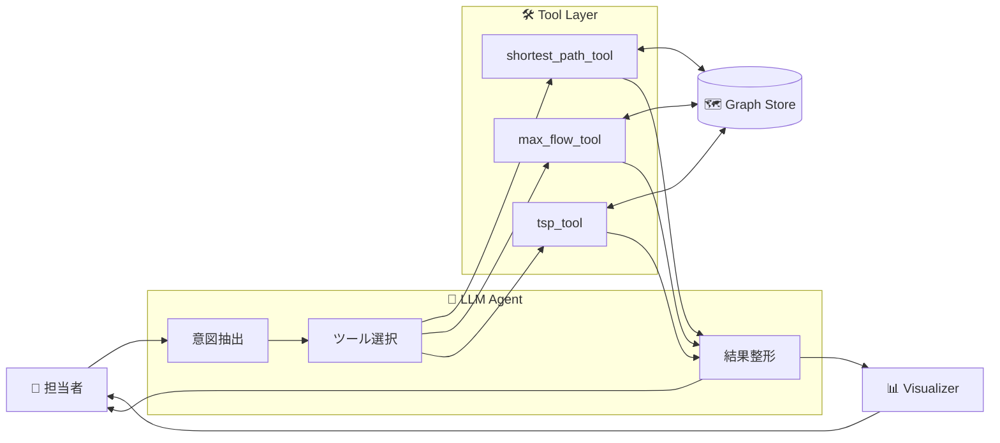
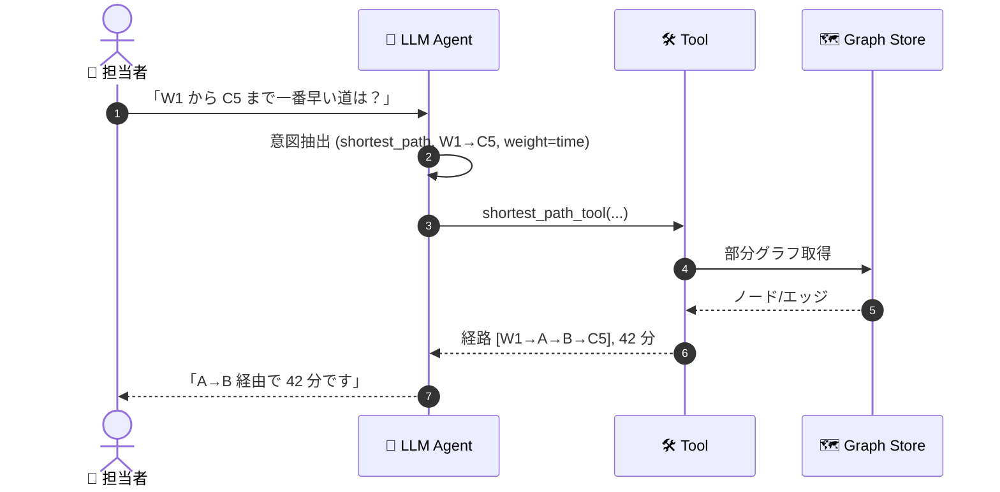
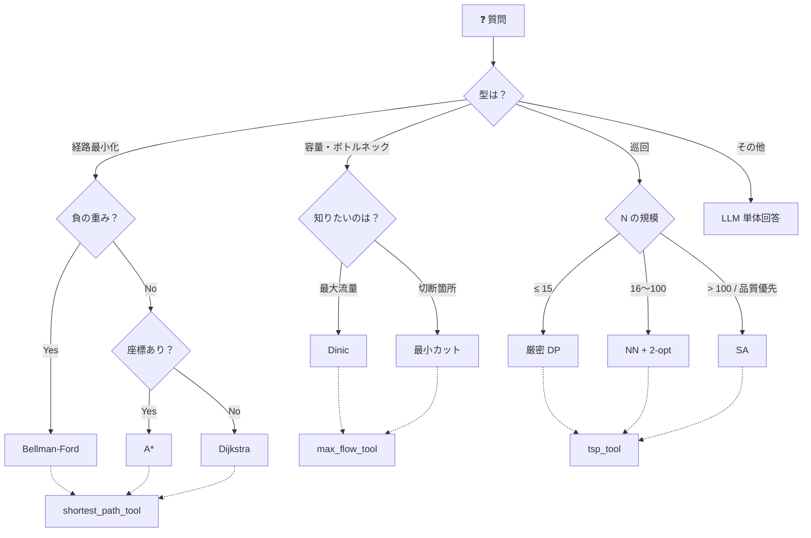
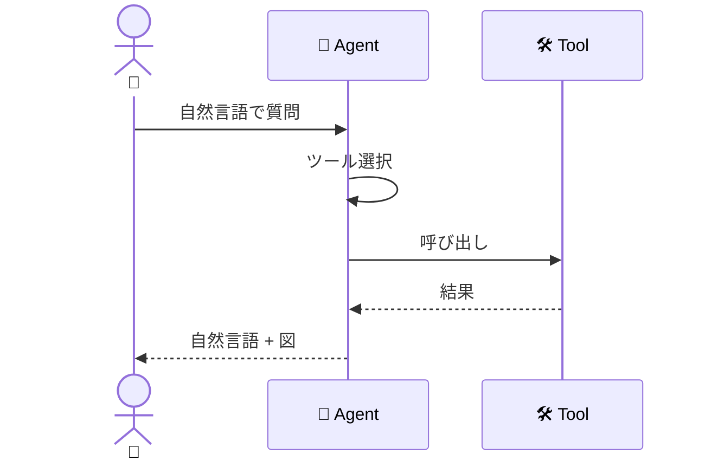
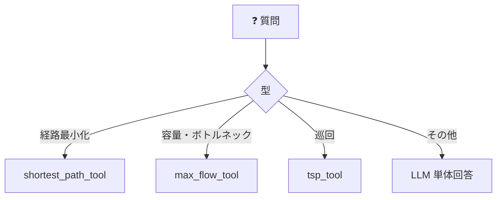

# デモシナリオ詳細 — 物流・配送ネットワーク

`scenario.md` の概要を物流・配送ネットワークを題材に具体化したもの。

<!-- @import "[TOC]" {cmd="toc" depthFrom=1 depthTo=6 orderedList=false} -->

<!-- code_chunk_output -->

- [デモシナリオ詳細 — 物流・配送ネットワーク](#デモシナリオ詳細--物流配送ネットワーク)
  - [1. シナリオ背景](#1-シナリオ背景)
  - [2. Mermaid 図 ① — 全体図](#2-mermaid-図-1--全体図)
    - [2-1. システム構成](#2-1-システム構成)
    - [2-2. 会話シーケンス](#2-2-会話シーケンス)
    - [2-3. アルゴリズム選択 決定木](#2-3-アルゴリズム選択-決定木)
  - [3. Mermaid 図 ② — 簡易版](#3-mermaid-図-2--簡易版)
    - [3-1. 会話シーケンス（簡易）](#3-1-会話シーケンス簡易)
    - [3-2. アルゴリズム選択（簡易）](#3-2-アルゴリズム選択簡易)
  - [4. 質問例とアルゴリズム対応表](#4-質問例とアルゴリズム対応表)
  - [5. 実装サンプル（pydantic-ai）](#5-実装サンプルpydantic-ai)
    - [5-1. Agent 定義](#5-1-agent-定義)
    - [5-2. shortest_path_tool](#5-2-shortest_path_tool)
    - [5-3. max_flow_tool](#5-3-max_flow_tool)
    - [5-4. tsp_tool](#5-4-tsp_tool)
    - [5-5. 呼び出し例](#5-5-呼び出し例)

<!-- /code_chunk_output -->


---

## 1. シナリオ背景

- **ノード**: 倉庫 `W1, W2` / 拠点 `A, B, C, ...` / 顧客 `C1, C2, ...`
- **エッジ**: 道路区間 `R1, R2, ...`（属性: 距離 km、所要時間 min、容量 台/h）
- **ユーザー**: 配車計画担当者。自然言語でエージェントに依頼する。
- **エージェント**: 意図解釈 → 最適化ツール選択 → 結果を自然言語＋図で返す。

---

## 2. Mermaid 図 ① — 全体図

### 2-1. システム構成



### 2-2. 会話シーケンス



### 2-3. アルゴリズム選択 決定木



---

## 3. Mermaid 図 ② — 簡易版

### 3-1. 会話シーケンス（簡易）



### 3-2. アルゴリズム選択（簡易）



---

## 4. 質問例とアルゴリズム対応表

| # | ユーザーの質問例 | ツール | 内部アルゴリズム |
|---|---|---|---|
| 1 | 「W1 から C5 まで、いま一番早い道は？」 | `shortest_path_tool` | Dijkstra |
| 2 | 「R7 が事故で止まった。どの配送先が遅れる？」 | `shortest_path_tool` | Dijkstra 再実行 |
| 3 | 「初めて行く C12、拠点 A からざっくり最短で出して」 | `shortest_path_tool` | A* |
| 4 | 「ピーク日、W1 から全配送先に 1 時間で何台送れる？」 | `max_flow_tool` | Dinic |
| 5 | 「配送が詰まる。どこを増強すれば一番効く？」 | `max_flow_tool` | 最小カット |
| 6 | 「12 軒回る順番を組んでほしい」 | `tsp_tool` | 厳密 DP |
| 7 | 「50 件、1 台で回す順を 5 分で出して」 | `tsp_tool` | NN + 2-opt |
| 8 | 「80 件、時間かけていいから最良の順番で」 | `tsp_tool` | Simulated Annealing |

各行は §2-3 の決定木の葉と 1 対 1 対応。

---

## 5. 実装サンプル（pydantic-ai）

### 5-1. Agent 定義

```python
from dataclasses import dataclass
from typing import Literal

from pydantic import BaseModel
from pydantic_ai import Agent, RunContext


@dataclass
class GraphCtx:
    store: "GraphStore"


agent = Agent[GraphCtx, str](
    model="openai:gpt-4o",
    deps_type=GraphCtx,
    system_prompt=(
        "配車計画担当者を支援するエージェント。"
        "依頼を読み取り、登録ツールから最適な 1 つを選んで呼び出す。"
        "情報が足りなければ追加質問する。結果は短く現場の言葉で返す。"
    ),
)
```

### 5-2. shortest_path_tool

```python
class ShortestPathResult(BaseModel):
    path: list[str]
    cost: float


@agent.tool
def shortest_path_tool(
    ctx: RunContext[GraphCtx],
    source: str,
    target: str,
    weight: Literal["time", "distance"] = "time",
    allow_negative: bool = False,
    heuristic: Literal["euclidean", "none"] = "none",
    blocked_edges: list[str] | None = None,
) -> ShortestPathResult:
    """単一始点→終点の最小コスト経路。

    allow_negative → Bellman-Ford / heuristic="euclidean" → A* / 既定は Dijkstra。
    blocked_edges は通行不能扱い。
    """
    g = ctx.deps.store.subgraph(blocked_edges=blocked_edges or [])
    if allow_negative:
        path, cost = g.bellman_ford(source, target, weight=weight)
    elif heuristic == "euclidean":
        path, cost = g.a_star(source, target, weight=weight)
    else:
        path, cost = g.dijkstra(source, target, weight=weight)
    return ShortestPathResult(path=path, cost=cost)
```

### 5-3. max_flow_tool

```python
class MaxFlowResult(BaseModel):
    max_flow: float
    min_cut_edges: list[str] | None = None


@agent.tool
def max_flow_tool(
    ctx: RunContext[GraphCtx],
    source: str,
    sink: str | Literal["all_customers"],
    capacity_field: Literal["trucks_per_hour"] = "trucks_per_hour",
    return_min_cut: bool = False,
) -> MaxFlowResult:
    """source→sink の最大流 (Dinic)。return_min_cut で最小カット併用。"""
    g = ctx.deps.store
    flow, cut = g.dinic(source, sink, capacity=capacity_field, with_cut=return_min_cut)
    return MaxFlowResult(max_flow=flow, min_cut_edges=cut if return_min_cut else None)
```

### 5-4. tsp_tool

```python
class TspResult(BaseModel):
    tour: list[str]
    total_cost: float


@agent.tool
def tsp_tool(
    ctx: RunContext[GraphCtx],
    node_set: list[str],
    start_node: str,
    weight: Literal["time", "distance"] = "time",
    method: Literal["exact", "2opt", "sa", "auto"] = "auto",
    time_budget_sec: int = 10,
) -> TspResult:
    """node_set を 1 台で巡回。

    method="auto" は N≤15:exact / 16〜100:2opt / それ以上:sa。
    """
    g = ctx.deps.store
    if method == "auto":
        n = len(node_set)
        method = "exact" if n <= 15 else "2opt" if n <= 100 else "sa"
    if method == "exact":
        tour, cost = g.tsp_exact(node_set, start_node, weight=weight)
    elif method == "2opt":
        tour, cost = g.tsp_2opt(node_set, start_node, weight=weight)
    else:
        tour, cost = g.tsp_sa(node_set, start_node, weight=weight,
                              time_budget_sec=time_budget_sec)
    return TspResult(tour=tour, total_cost=cost)
```

### 5-5. 呼び出し例

```python
deps = GraphCtx(store=load_graph_store("data/graph.json"))
result = agent.run_sync(
    "C1..C12 を 1 台で回る効率いい順番を出して。始点は W1。",
    deps=deps,
)
print(result.output)
```
