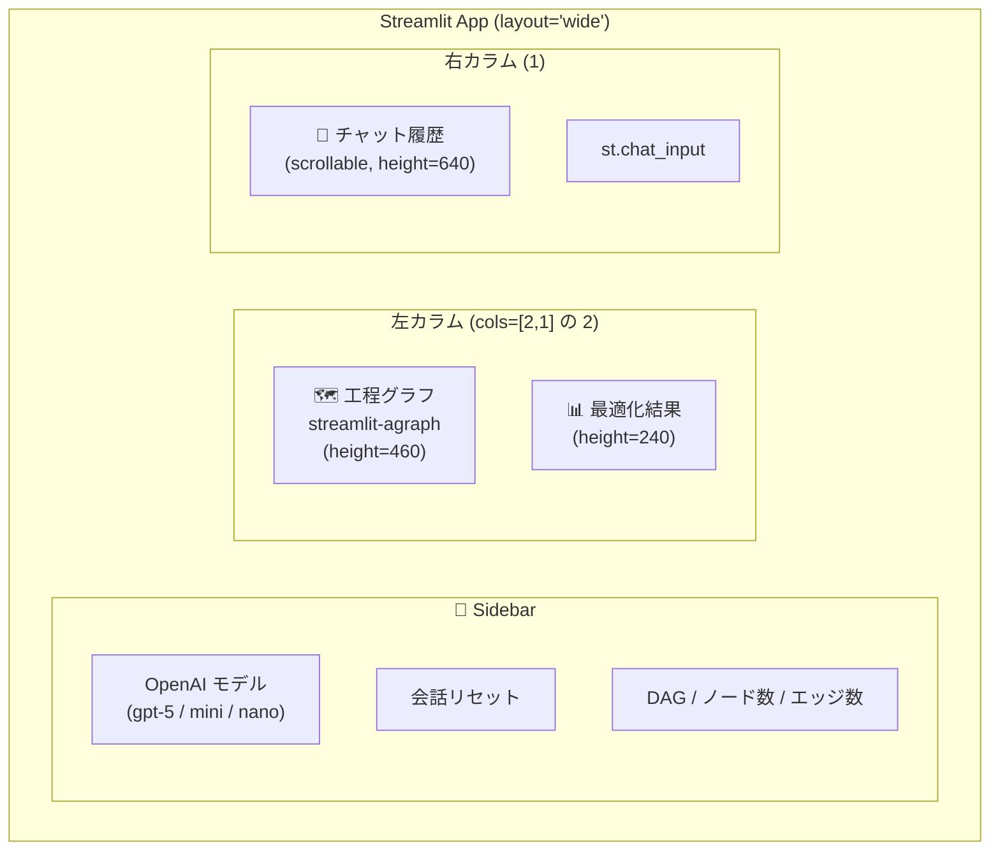
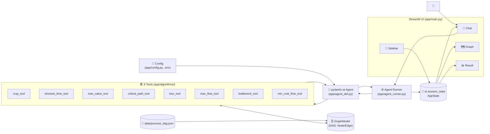
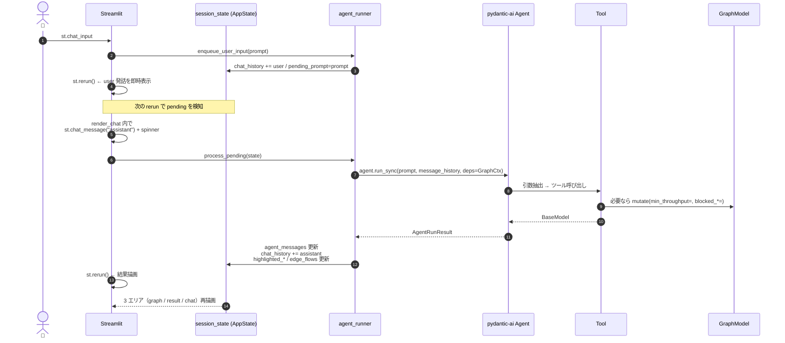
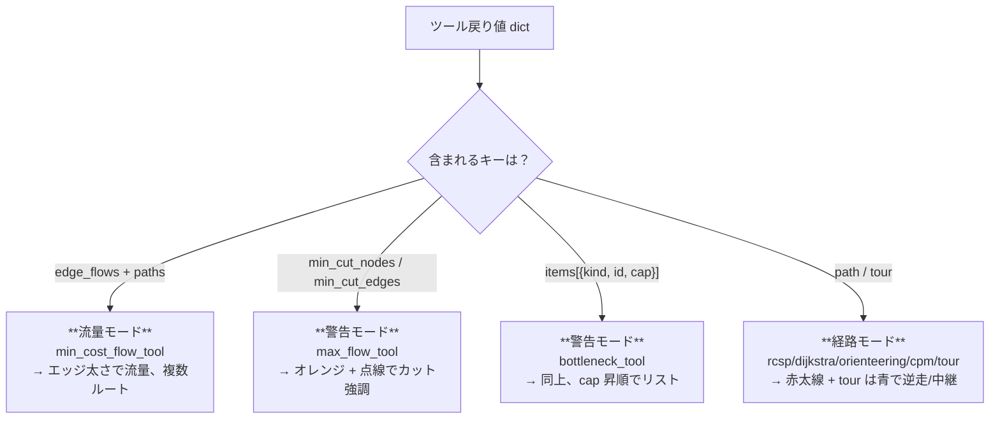

# システムアーキテクチャ — UI 含む全体像

Streamlit + pydantic-ai + NetworkX で構成される、現状実装の完全版アーキテクチャ。
`scenario/architecture.md` の初期設計に対し、throughput/lanes 追加 + 8 ツール構成 +
4 種類の描画モードまで反映した最新版。

<!-- @import "[TOC]" {cmd="toc" depthFrom=1 depthTo=6 orderedList=false} -->

---

## 1. UI レイアウト



実装: [app/main.py:125-150](app/main.py#L125-L150)

---

## 2. システム構成



---

## 3. データモデル

### Node（工場 / 倉庫）
- `id`: 識別子
- `t_proc` (float, 分/個): 1 個あたり処理時間
- `v` (float): 1 個あたり付与価値
- `lanes` (int): 並列ライン数
- `cap` (派生 property, 個/h) = `lanes × 60 / t_proc`
  - `t_proc=0` または `lanes=0` のとき `None`（倉庫扱い、無制限）

### Edge（配送路）
- `src`, `dst`: 端点
- `t_move` (float, 分): 移動時間
- `cap` (float | None, 個/h): 搬送容量

実装: [app/graph_model.py](app/graph_model.py)

---

## 4. アルゴリズム層（8 ツール）

| グループ | ツール | 内部アルゴリズム | 実装 |
|---|---|---|---|
| **単一経路** | `shortest_time_tool` | NetworkX Dijkstra | [shortest_path.py](app/algorithms/shortest_path.py) |
|  | `rcsp_tool` | DAG 上の `(node, value_bucket)` DP | [rcsp.py](app/algorithms/rcsp.py) |
|  | `max_value_tool` | DAG 上の `(node, time_bucket)` DP | [orienteering.py](app/algorithms/orienteering.py) |
|  | `critical_path_tool` | NetworkX `dag_longest_path` | [cpm.py](app/algorithms/cpm.py) |
|  | `tour_tool` | bitmask DP / NN+2-opt / SA (自前実装) | [tsp.py](app/algorithms/tsp.py) |
| **フロー系** | `max_flow_tool` | NetworkX `minimum_cut` + ノード分割 | [max_flow.py](app/algorithms/max_flow.py) |
|  | `bottleneck_tool` | max-flow の最小カット結果を cap 昇順に整列 | [bottleneck.py](app/algorithms/bottleneck.py) |
|  | `min_cost_flow_tool` | NetworkX `network_simplex` + フロー分解 | [min_cost_flow.py](app/algorithms/min_cost_flow.py) |

**共通フック**: 単一経路系すべてに `min_throughput` 引数。`cap < min_throughput` のノード/エッジを
`GraphModel.mutate(min_throughput=...)` で自動 blocked 化（[graph_model.py:79-90](app/graph_model.py#L79-L90)）。

---

## 5. Agent 層（pydantic-ai）

```python
agent = Agent[GraphCtx, str](
    model=f"openai-chat:{model_name}",   # gpt-5 / gpt-5-mini / gpt-5-nano
    deps_type=GraphCtx,
    system_prompt=_SYSTEM_PROMPT,
)
```

- **モデル切替**: サイドバー selectbox → `state.model_name` → `get_agent(model_name)` が
  `_agent_cache: dict[str, Agent]` に積む（[agent_def.py:88](app/agent_def.py#L88)）
- **DI**: `RunContext[GraphCtx]` 経由で各ツールが `ctx.deps.store` (GraphModel) を参照
- **マルチターン**: `agent.run_sync(prompt, message_history=state.agent_messages, deps=...)`
  → `result.all_messages()` を session_state に積み戻す
- **ツール戻り値**: 各ツールは `pydantic.BaseModel` を返す
  （例: `MinCostFlowResult{achieved_flow, total_value, total_cost, avg_time_per_unit, edge_flows, paths}`）

---

## 6. st.session_state（AppState）

| キー | 型 | 役割 |
|---|---|---|
| `graph` | `GraphModel` | DAG 本体（読み込み済み） |
| `model_name` | `str` | 現在の OpenAI モデル名 |
| `chat_history` | `list[ChatMessage]` | UI 描画用の会話履歴 |
| `agent_messages` | `list[ModelMessage]` | pydantic-ai に渡すマルチターン履歴 |
| `last_result` | `dict \| None` | 最後のツール戻り値（`model_dump()` 済み） |
| `last_tool_name` | `str \| None` | 最後に呼ばれたツール名 |
| `highlighted_path` | `list[str]` | 単一経路系の path |
| `highlighted_nodes` | `list[str]` | 警告強調するノード（min cut 等） |
| `highlighted_edges` | `list[tuple[str,str]]` | 警告強調するエッジ |
| `edge_flows` | `list[tuple[str,str,float]]` | min_cost_flow の流量結果 |
| `pending_prompt` | `str \| None` | rerun 待ちの未処理依頼 |

実装: [app/state.py](app/state.py)

---

## 7. 1 ターンのデータフロー



実装: [app/agent_runner.py](app/agent_runner.py)

---

## 8. 描画モード（4 種、自動切替）

`agent_runner._extract_visuals(data)` が戻り値の形を見て **どの session_state を埋めるか** を決め、
`graph_view.render_graph` がその state を見て **どのモードで描くか** を分岐する。



結果パネル（`render_result`）も同じ 4 モードに分岐。
- 流量: 生産個数 / 価値 / 人時 / 1個平均 + 経路ごとの個数と価値
- 最大流: 最大流量 + ボトルネック工場・区間リスト
- ボトルネック: 増強優先順リスト
- 単一経路: 総時間 / 総価値 / 経路長 + 経路

実装: [agent_runner.py:_extract_visuals](app/agent_runner.py)、[graph_view.py:render_graph](app/graph_view.py)、[main.py:render_result](app/main.py#L39)

---

## 9. ファイル構成

```
app/
├── main.py              # ページレイアウト + チャットループ
├── state.py             # AppState / session_state
├── config.py            # .env / OPENAI_MODEL / AVAILABLE_MODELS
├── graph_model.py       # Node (lanes 派生 cap) / Edge / GraphModel
├── graph_view.py        # streamlit-agraph 描画 (4 モード)
├── agent_def.py         # pydantic-ai Agent + 8 tool 登録 + system_prompt
├── agent_runner.py      # enqueue / process_pending / 戻り値抽出
└── algorithms/          # rcsp / shortest_path / orienteering /
                         # cpm / tsp / max_flow / bottleneck / min_cost_flow
data/
└── process_dag.json     # サンプル DAG (12 ノード, 23 エッジ)
scenario/
├── scenario.md                  # 概要
├── demo_manufacturing.md        # シナリオ詳細とツール仕様
├── architecture.md              # 初期設計（旧）
├── system_architecture.md       # 本ファイル — 最新の全体像
└── industry_applications.md     # 産業応用の整理
```

---

## 10. 拡張ポイント

| 拡張 | 主な変更箇所 |
|---|---|
| 新ツール追加 | `app/algorithms/<new>.py` 作成 → `app/algorithms/__init__.py` で export → `app/agent_def.py` に `@agent.tool` 登録 + `system_prompt` 更新 |
| 新業界へ移植 | `data/<domain>_graph.json` 用意 → `system_prompt` の語彙を差し替え |
| 新しい描画モード | `state.py` に新フィールド → `agent_runner._extract_visuals` で抽出 → `graph_view.render_graph` で分岐追加 |
| 別 LLM プロバイダ | `app/config.py` の `AVAILABLE_MODELS` + `agent_def.get_agent` の model 文字列を変更（pydantic-ai が anthropic/google など多数サポート） |
| ストリーミング応答 | `agent.iter()` / `agent.run_stream()` に切替 + `process_pending` を async 化 |
