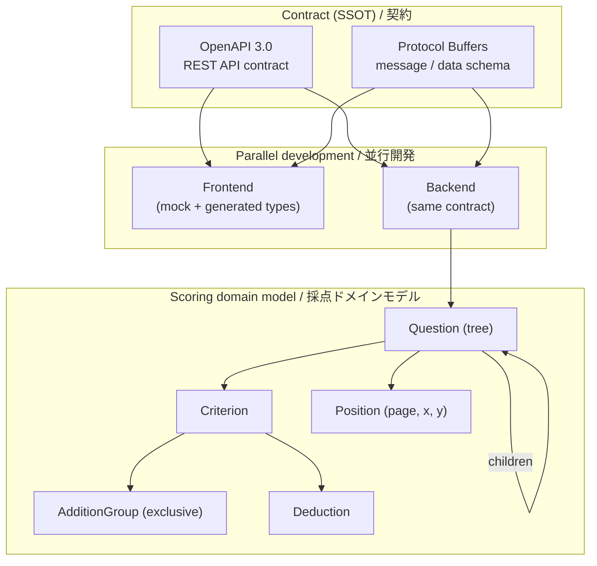

# Architecture / アーキテクチャ

All identifiers below are **placeholders**. This document shows how the contract and the scoring model fit together.
以下の識別子はすべて**プレースホルダ**です。本書では契約と採点モデルの関係を示します。

---

## Contract & scoring model / 契約と採点モデル

The **contract** (OpenAPI + Protobuf) is the single source of truth. Frontend and backend are developed in parallel against it, and the backend maps the contract onto a typed **scoring domain model**.

**契約**（OpenAPI + Protobuf）を単一の真実の源とし、フロント/バックがこれを起点に並行開発。バックエンドは契約を型付きの**採点ドメインモデル**へ落とし込みます。

**Why this shape / なぜこの構成か**
- **Contract as SSOT:** OpenAPIでAPI契約、Protobufでデータ契約を先に固定し、境界の型整合とフロント/バックの並行開発を両立。
- **Recursive question tree:** 設問は自己参照ツリー（大問→小問）。末端の設問が実際の採点対象となり、上位は小計を持つ。
- **Exclusive addition groups:** 採点基準は「加点グループ（グループ内で高々1つ選択）＋減点」で構成し、部分点の排他性を型で表現。
- **Positional metadata:** 点数・採点記号・コメントの描画位置をページ＋座標のPositionとして分離し、採点ロジックと描画関心を疎結合に。

---

## Cross-cutting concerns / 横断的関心事

- **Type safety / 型安全:** 採点モデルは `frozen` dataclass の不変値オブジェクト。`enum` で設問形式を固定し、mypyで静的チェック。
- **Contract discipline / 契約規律:** スキーマ変更はGitでレビューし、破壊的変更を境界で検知。required/optionalを契約で明示。
- **Security / セキュリティ:** 答案PDF/画像は署名付きURLで受け渡し。認証はOIDC/Bearer、セッションはHttpOnly Cookie。識別子はすべてプレースホルダ。
