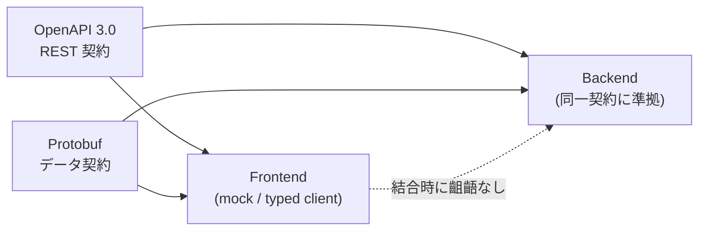

# 01. Contract-First Design / コントラクトファースト設計

> Define the REST API contract (OpenAPI) and the data schema (Protobuf) **before** implementation, so the frontend and backend can be built in parallel with guaranteed type alignment.
> REST APIの契約（OpenAPI）とデータスキーマ（Protobuf）を実装より先に定義し、フロント/バックの並行開発と型整合を担保する。

関連スニペット: [question.proto](../snippets/question.proto)

---

## 課題 / Problem

答案採点のデータ構造は複雑です。設問はツリー（大問→小問）を持ち、各設問には採点基準（加点グループ・減点）や座標が紐づきます。この構造を**口頭やドキュメントだけ**でフロント/バックが共有すると、フィールド名・型・必須有無の解釈がずれ、実装後に手戻りが発生します。フロントとバックを並行で進めたいほど、この齟齬のコストは大きくなります。

Answer-grading data is structurally complex — a recursive question tree, per-question rubrics, and coordinates. Sharing that shape only through prose leads to mismatched fields and types, and expensive rework once code exists.

## 技術的な工夫 / Key engineering decisions

- **契約を単一の真実の源（SSOT）に**
  **OpenAPI**でREST契約（エンドポイント・リクエスト/レスポンス・スキーマ）を、**Protobuf**でメッセージ/データ契約（設問・採点基準・座標）を先に定義。実装ではなく契約を「正」とし、双方がここを参照する。

- **並行開発の担保**
  フロントは契約から生成した型やモックで先行実装でき、バックは同じ契約に沿って独立実装できる。結合時のズレを最小化する。

- **言語非依存のデータ契約（Protobuf）**
  設問モデルをProtobufメッセージで表現することで、実装言語に依存しない型付きスキーマを提供（[question.proto](../snippets/question.proto) 参照）。フロント/バックが別言語でも同じ型定義を共有できる。

- **曖昧さの排除**
  設問形式（選択式/短答式/自由記述/回答不可）を**列挙型**で固定し、required/optionalを契約で明示。「どのフィールドが必須か」を実装依存にしない。

- **契約とコードの乖離防止**
  スキーマ変更はGitでレビューし、破壊的変更を境界で検知。契約が変われば双方が追随する運用に。

## 契約フロー / Contract flow

## 効果 / Impact

- フロント/バックの**並行開発**が可能になり、結合時の手戻りを削減
- 契約を起点にした**型整合**で、フィールド解釈のズレを防止
- 列挙型・required/optionalの明示により、仕様の曖昧さを設計段階で排除
