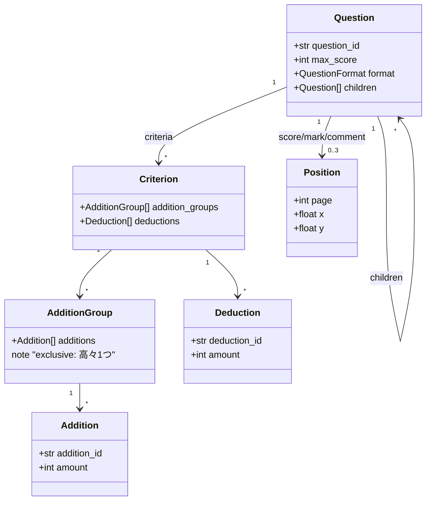

# 02. Partial-Credit Scoring / 部分点採点モデル

> A typed model for partial-credit grading: a recursive question tree, exclusive addition groups, deductions, and score clamping — expressed as immutable value objects.
> 部分点採点の型付きモデル。設問ツリー・排他的な加点グループ・減点・上限クランプを、不変な値オブジェクトとして表現する。

関連スニペット: [partial_credit_scorer.py](../snippets/partial_credit_scorer.py)

---

## 課題 / Problem

記述式答案の**部分点採点**は、単純な正誤よりも複雑です。1つの設問に対して複数の観点で加点があり、観点ごとには**どれか1つの加点しか認めない（排他）**ことがあります。さらに減点が重なり、合計は0点〜満点の範囲に収める必要があります。この規則を曖昧なまま実装すると、境界条件（マイナス点・満点超過・二重加点）でバグが出ます。

Partial-credit grading is more than right/wrong. A question can earn points from several rubric axes, each axis may allow **only one** addition (exclusive), deductions stack, and the total must be clamped to `[0, max]`. Encoding this loosely invites boundary bugs.

## 技術的な工夫 / Key engineering decisions

- **設問を再帰ツリーで表現**
  設問は自己参照ツリー（大問→小問）。上位ノードは小計を、末端の設問が実際の採点対象を持つ。構造をそのまま型に落とす。

- **採点基準 = 加点グループ（排他）＋減点**
  採点基準を「加点グループ（グループ内で高々1つだけ加点）」と「減点」の組で表現。**排他性を型と計算ロジックで担保**し、二重加点を構造的に防ぐ。

- **不変な値オブジェクトで型設計**
  採点モデルは `frozen=True` の dataclass で不変化。副作用のない純粋な計算に寄せ、テストと推論を容易にする（[partial_credit_scorer.py](../snippets/partial_credit_scorer.py) 参照）。

- **スコア計算のクランプ**
  合計＝Σ加点 − Σ減点 を `[0, 満点]` にクランプ。マイナス点や満点超過を境界で吸収し、常に妥当なスコアを返す。

- **位置情報の分離（Position）**
  点数・採点記号・コメントの描画位置（ページ・座標）を採点ロジックから切り離し、独立した型で表現。採点計算と描画関心を疎結合に保つ。

## 採点モデル / Scoring model

## 効果 / Impact

- 加点の**排他性**とスコアの**クランプ**を型・ロジックで保証し、境界条件のバグを予防
- 不変値オブジェクト＋純粋計算により、採点ロジックが**テストしやすく**なる
- 位置情報を分離することで、採点計算と答案描画の関心を疎結合に保てる
